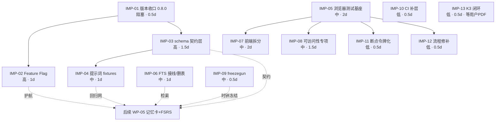

# MedKit 工程全面审查与结构化改进指南（2026-08-27）

> **实施状态（2026-08-27 收尾）**：IMP-01~12 已全部落地，commit `74ad818`→`2b572d1`；
> 总闸 `verify.cmd` 全绿（277 pytest + 9 Playwright），v0.8.0 已发布基线；
> IMP-13 待用户提供 306 大纲 PDF。本文件已随 S1 审查全套归档至 `docs/archive/reviews/s1-2026-08-27/`。

> 用途：供后续 agent 直接执行的结构化改进指南。
> 审查依据：①《医学教育需求审查报告_2026-08-27.md》（12 条需求建议，P0/P1/P2）
> ②《结构化执行方案_2026-08-27.md》（S0~S3 工作包 + 横切工程规范 §6 + 回滚矩阵 §7）
> ③《前端设计审查报告_2026-08-27.md》（七轮 UI/UX 审查标准）
> ④ 当前代码基线逐条核验（git HEAD = `74bb8c3` feat(wp04)，工作树干净）。
> 所有结论均附文件级证据；改进项全部给出可执行粒度（文件路径 + 函数级修改点）。

---

## 1. 工程现状概览

### 1.1 架构模式

**本地优先（Local-First）单进程 Web 应用**：FastAPI 后端 + 零 CDN 单页前端，浏览器访问 `127.0.0.1:4880~4889`。
无账号、无云端、用户 BYOK（自带 API Key）；数据全部落 `~/.medkit/`。

```
浏览器（web/index.html 单页，4299 行）
   │  fetch /api/*（同源，Host/Origin 守卫中间件）
   ▼
FastAPI（medkit/main.py，lifespan + 15 个 include_router）
   ├─ routers/*（15 模块：config/projects/parse/pipeline/prompts/presets/search/ocr
   │             /library/review/syllabus/realexams/gap/update）
   │     │  只写 HTTP 语义；共享可变状态集中在 medkit/state.py
   │     ▼
   ├─ core/*（24 模块，纯逻辑层）
   │     ├─ 存储底座：db.py（SQLite WAL + user_version 迁移 v1~v3 + 升级前备份 + JSON 幂等导入）
   │     │     ↑ 被 library/review/explain/tutor 四域经「咽喉点路由 + _store() 事务」调用
   │     ├─ 领域：library（错题/掌握度/数据卫生）· review（SM-2）· explain · tutor
   │     │        · syllabus（大纲覆盖）· realexams（考频）· gap（薄弱组卷）· dashboard
   │     ├─ 管线：orchestrator（五阶段编排 + 断点/取消）→ agents/*（medgen/medqc/medfix/
   │     │        medreview/medexplain/medtutor）→ gates/*（options/bloom/trace/dedup 四门禁）
   │     │        → render/*（qbank_html / review_html / apkg / pagechrome 主题单源）
   │     └─ 基础设施：config（DPAPI 加密 Key）· providers · llm（chat_json）· cost · usage
   │              · extract/slice/quota · mineru（OCR）· websearch · update · sessions · presets
   ▼
~/.medkit/（config.json[Key DPAPI] · library/medkit.db[WAL] · projects/{pid}/ · sessions/ ·
           prompts/影子副本 · logs/RotatingFileHandler）
```

**模块依赖方向（单向，无环）**：`routers → core → db/llm`；`agents → core/llm + core/cost`；`orchestrator → agents + gates + render`；`render ← orchestrator`（单向产出 HTML）；`web → routers`（HTTP）。`core/*` 之间允许横向调用（如 gap → library/recommend、syllabus → library）。

### 1.2 技术栈选型

| 层 | 选型 | 备注 |
|---|---|---|
| 后端 | Python 3.12 + FastAPI ≥0.110 + uvicorn | pydantic 仅用于请求体（routers 层） |
| LLM 接入 | openai SDK ≥1.30（OpenAI 兼容端点）+ httpx | DeepSeek/GLM/千问/Kimi 预置 + 自定义 |
| 文档解析 | pymupdf / python-docx / markdown | MinerU 云端 OCR（任务制） |
| 存储 | stdlib sqlite3（WAL，FTS5 可用）+ JSON 兼容读 | ADR-001/005；JSON 为一次性导入源 |
| 前端 | 单文件原生 HTML/CSS/JS，零框架零 CDN | hash 路由 + sessionStorage 视图记忆 |
| Anki | genanki 0.13.1（.apkg 真包） | 稳定哈希命名 |
| 测试 | pytest 8 + pytest-timeout，23 个测试文件，217+ 用例 | 双 OS CI（ubuntu/windows）+ ruff |
| 打包 | PyInstaller（medkit.spec）+ Inno Setup（pack/*.iss） | 版本单源 `medkit/__init__.py` |

### 1.3 关键配置文件

| 文件 | 作用 | 现状评价 |
|---|---|---|
| `medkit/__init__.py` | 版本单源 `__version__` | ⚠️ 当前 `0.7.0`，与已合入的 v0.8 功能不一致（见 G-01） |
| `pyproject.toml` | ruff（E/F/W/I/B，line 100）+ pytest（timeout 300） | 合规；未注册自定义 marker（见 G-09） |
| `requirements.txt` / `requirements-dev.txt` | 运行/开发依赖 | ⚠️ dev 缺 freezegun（D7，见 G-08） |
| `verify.cmd` | 一键验证总闸 | ⚠️ 仅 ruff + pytest，无浏览器用例（§6.1 新增要求，见 G-06） |
| `.github/workflows/ci.yml` | 双 OS：ruff + pytest --timeout=300 | ⚠️ 缺 `pytest -m migration` 与 `pip check`（§6.1，见 G-09） |
| `medkit.spec` / `pack/build.bat` / `medkit.iss` | 打包与安装包 | 合规（版本从单源生成 version.iss） |
| `docs/adr/ADR-001~005` | 选型决策记录 | ⚠️ ADR-003（pydantic 契约）已接受但代码未落地（见 G-03） |

---

## 2. 差距分析

> 严重度分级：**阻塞** = 不修复不能发布/不能继续后续 WP；**高** = 违反已立规矩或影响数据正确性/可回滚性；**中** = 规范缺位或体验缺陷；**低** = 打磨项。

### G-01 版本号未随 v0.8 功能落地 bump【高】
- **偏差**：`medkit/__init__.py` `__version__ = "0.7.0"`，但 WP-01~04（v0.8 考试锚定）四个 commit 已合入主线；README 安装包名仍为 `MedKit-Setup-0.7.0.exe`。
- **影响范围**：打包发布（`pack/build.bat` → version.iss → 安装包名）、内置更新检查（`core/update.py` 与 GitHub Release 比对会误报/漏报）、邮件反馈附带版本号。
- **根因**：S0 校对第④条只执行了「v0.6→v0.7 bump + 提交」，WP-01~04 落地时未建立「Sprint 末 bump 版本」的检查点；执行方案 §6.3 发布流程未被执行。
- **证据**：`medkit/__init__.py:4`；git log 显示 wp01~wp04 已提交。

### G-02 Feature Flag 机制整体缺失【高】
- **偏差**：执行方案 §0.4 明确要求「每个 WP 独立 feature flag（新建 `core/state.py` FLAG + 前端 feature 常量），出问题即关」；§7 回滚矩阵第一行即「任一 WP 功能 → 独立 feature flag 关闭」。实测 `state.py` 仅 16 行运行锁状态，全仓库 grep 无任何 flag 机制；WP-01~04 全部硬编码上线。
- **影响范围**：`routers/syllabus.py`、`routers/realexams.py`、`routers/gap.py`、`routers/projects.py`（图片素材 assets）、`web/index.html` 学习中心第 6 视图与「一键刷薄弱」入口——任一功能出线上问题只能回滚 commit，不能运行时关闭。
- **根因**：S0 只交付了 db.py 底座，flag 机制（方案自认「全新建设」）被跳过；WP 落地记录中无 flag 检查项。
- **证据**：`medkit/state.py` 全文；`grep -rni "feature.flag|FEATURE_" medkit/` 零命中。

### G-03 LLM 结构化输出契约层（`core/schema.py`）未建设【高】
- **偏差**：ADR-003（已接受）+ 执行方案 D3 要求新增 `core/schema.py`：LLM JSON 输出先 `model_validate`，失败带错误重发 1 次修复，仍失败进人工复核清单。实测文件不存在；`chat_json` 调用点（`agents/medgen.py`、`agents/medqc.py`、`agents/medfix.py`、`agents/medexplain.py`、`agents/medtutor.py`、`core/realexams.py` LLM 归一开关）均无契约校验。
- **影响范围**：全部生成式输出的字段完整性依赖各 agent 手写容错，标准不一；X 型答案升序、image_ref 存在性等不变式只在门禁/orchestrator 层部分覆盖，无统一兜底。
- **根因**：ADR 标注「落地随 WP-01/02/05」，但 WP-01 改为本地规则零 LLM、WP-02 改为词典匹配零 LLM 后，契约层失去挂点被顺延遗忘。
- **证据**：`ls medkit/core/schema.py` 不存在；`grep -rn "model_validate" medkit/` 仅 routers 请求体命中。

### G-04 `slices_fts` 死表：FTS5+jieba 检索未接线【中】
- **偏差**：D2/ADR-002 决策「SQLite FTS5 + jieba 预分词列」，K1 SPIKE 已验证可行；`db.py` 迁移 v1 建了 `slices_fts` 虚拟表，但全仓库无任何代码写入/查询该表，jieba 不在 requirements。当前「复习卡查看提示」走 `core/library.py` 的 Python 关键词 top-k。
- **影响范围**：检索质量停留在子串匹配（无法分词、无 BM25 排序）；死 schema 增加迁移面与认知负担。
- **根因**：S1 各 WP 的检索需求被「关键词 top-k 够用」临时替代，FTS 集成无 WP 认领。
- **证据**：`grep -rn "slices_fts" medkit/` 仅 db.py 建/删表两处；`grep -rln jieba medkit/` 零命中。
- **决策点**：二选一——(a) 接线（explain/slices 查询改走 FTS，WP-05 卡检索复用）；(b) 明确放弃，迁移 v4 删表并在 ADR-002 补记。建议 (a)，WP-05 前必须收口。

### G-05 CHANGELOG.md 缺失【中】
- **偏差**：§6.3 要求「CHANGELOG.md（Keep a Changelog）新增，从 v0.8 起每版本记录 WP 清单」。文件不存在。
- **影响范围**：发布流程（用户无法从 Release 页外获知变更）；提示词版本治理（§6.2 要求 prompt 版本号进 docs 无落点）。
- **根因**：与 G-01 同源——发布流程未执行。

### G-06 浏览器测试未进 verify.cmd / 仓库【中】
- **偏差**：§6.1 要求「每 WP 至少 1 条 browser 用例（Playwright 双主题 + 窄屏 + 新视图）；verify.cmd 串联」，方案校对第②条确认这是**新增要求**。现状：`tests/` 无任何 browser 测试文件，verify.cmd 只有 ruff + pytest，WP-01~04 的浏览器验收全部停留在会话内人工 Playwright 审计（不可复现）。
- **影响范围**：前端回归无闸门；学习中心 6 视图、大纲覆盖树、真题考频卡、图片素材上传等重交互功能下次改动无防护。
- **根因**：Playwright 未引入 requirements-dev；人工审计产出未沉淀为脚本。

### G-07 提示词回归 fixtures（`tests/fixtures/llm_cases/`）未建设【中】
- **偏差**：§6.2 要求固定样本断言「schema 字段 + 关键不变式（X 型答案升序、image_ref 存在性）」。`tests/fixtures/` 目录为空。
- **影响范围**：6 个 prompts/*.md 的修改无回归网；与 G-03 互为表里（契约层定模型，fixtures 定样本）。
- **根因**：同 G-06，测试金字塔顶层两层整体未建。

### G-08 freezegun 未引入，时间相关测试随墙钟漂移【中】
- **偏差**：D7 决策「freezegun 进 requirements-dev」；`core/review.py`（SM-2 到期/due）、`core/gap.py`（24h 幂等窗）、dashboard 连续天数均用墙钟；requirements-dev.txt 只有 pytest + pytest-timeout。
- **影响范围**：`tests/test_review.py`、`test_library.py` 等在日期边界（月末/跨天）存在隐性脆弱；WP-05 FSRS 排程测试必须先有时钟冻结。
- **根因**：S0 SPIKE 聚焦存储与并发，D7 被漏执行。

### G-09 CI 缺 migration 标记测试与依赖完整性检查【低】
- **偏差**：§6.1 要求 CI 新增 `pytest -m "migration"` 与 `pip check`。现状 ci.yml 仅 ruff + pytest；pyproject.toml 未注册 `migration` marker（直接跑会 warning/选不中）。
- **根因**：同 G-06，CI 扩展未随 S1 落地。

### G-10 K3 SPIKE 未闭环（306 大纲 PDF → MinerU 抽取）【低】
- **偏差**：K3 通过标准「LLM 抽取正确率 ≥80%（10 条人核对）」未验证，状态 ⏸ 待用户提供 306 大纲 PDF。WP-01 已用「粘贴导入」保底上线，不阻塞功能，但 SPIKE 记录开口未关。
- **根因**：外部依赖（用户素材）。

### G-11 v0.8 收尾项未排程：WP-08 每日学习计划 / WP-09 数据可携带【中】
- **偏差**：README「后续可选」列出 WP-08/WP-09 为 v0.8 收尾；执行方案将 WP-08 划在 S2（依赖 WP-07）、WP-09 划在 S3。两处口径不一致，需要裁决。
- **建议裁决**：严格按执行方案路线图（WP-08 依赖 WP-07 洞察数据，提前做会返工；WP-09 依赖仅 S0 db，可提前）。**WP-09 可提入 v0.8 收尾，WP-08 留 S2。**
- **根因**：README 描述早于方案定稿，未回写。

### G-12 前端单文件 4299 行，可维护性逼近极限【中】
- **偏差**：前端审查报告 P3 已标注「建议把学习中心 CSS/JS 拆分为独立资源（保持零 CDN）」；此后又经四轮迭代涨到 4299 行（审查时 3370 行，+28%）。
- **影响范围**：`medkit/web/index.html` 全量；每次改 UI 的 diff 噪声、合并冲突、定位成本持续上升。
- **根因**：零 CDN 约束被等同于「单文件」；实际 FastAPI 静态目录可服务多文件（main.py 已挂静态目录），拆分不破坏零 CDN。
- **注意**：拆分属高风险重构（无 browser 测试网，见 G-06）——**必须先做 G-06 再做本项**。

### G-13 可访问性（A11y）系统性短板【中】
逐条核验结果：
| 检查项 | 现状 | 证据 |
|---|---|---|
| 应用内 ARIA | 部分：toast `role=status aria-live=polite` ✅、子导航 `aria-selected` ✅；但仅 29 处 aria-*，主 tab 栏无 `role=tablist/tab` 语义 | `web/index.html:918-924,1118` |
| 产物页 ARIA | **几乎为零**：qbank_html 1 处、review_html 0 处、pagechrome 0 处；押题卷答题卡、判分结果对错读屏不可达 | `grep -c "aria-\|role=" render/*.py` |
| 图片 alt | 全站仅 1 处 `alt=`；WP-04 新增 `<figure>` 教材图依赖 caption 但未强制 alt 文本 | `grep -c "alt=" web/index.html` |
| 表单语义 | 押题卷选项 `<label>/fieldset/name=` 仅 5 处命中，radio/checkbox 分组语义不完整 | `render/qbank_html.py` |
| 键盘导航 | `button:focus-visible` 轮廓 ✅、Esc 关弹窗 ✅、配比把手 ←/→ ✅；但学习中心 6 个子导航 pill 无方向键 ←/→ 切换（不符合 tab 模式 APG）、弹窗无 focus trap | `index.html:229,1220` |
| 跳转链接 | 无 skip-to-content 链接 | 全文 grep |
| 动效 | `prefers-reduced-motion` 已处理 ✅ | `index.html:390` |
| 对比度 | 未做量化审计（--mute 等次要文本色在双主题下未验 WCAG AA 4.5:1） | 需工具审计 |
- **影响范围**：视障/键鼠受限用户；产物页是学生高频面，短板最直接。
- **根因**：七轮前端审查聚焦信息架构与视觉，a11y 未列为审查维度；产物页模板（render/*.py）由 Python 字符串拼 HTML，无 lint 防线。

### G-14 响应式断点值不统一【低】
- **偏差**：全站混用 6 种断点：420 / 480 / 560 / 640 / 820 / 860px（16 条 @media）。同类布局（grid 降列）有的挂 820、有的挂 860。
- **影响范围**：`web/index.html` CSS；窗口缩放至 820~860px 区间时各卡片降列时机不一致，视觉跳动。
- **根因**：七轮迭代各自补断点，无设计令牌。
- **证据**：`grep -n "@media" web/index.html`。

### G-15 组件样式双轨：应用内 vs 产物页【低】
- **偏差**：pagechrome.py 已统一产物页**主题变量与基础样式**（第七轮成果 ✅），但组件类命名仍是两套：应用内 `.btn/.hint/.chip/.cardh/.empty` vs 产物页 `.mini/.hint/.tag/.chip`（pagechrome.BASE_CSS）；toast 只存在于应用内，产物页用内联提示条（第四轮已对齐风格 ✅，但实现各自维护）。
- **影响范围**：改按钮圆角/按钮态要改两处；新人认知成本。
- **根因**：pagechrome 收口到「主题单源」即止，组件层未收口。
- **建议**：pagechrome.py 的 BASE_CSS 增补产物页版 `.btn/.empty` 映射（不改 HTML 结构，纯 CSS 对齐），或接受现状并写入开发约定。低优先级。

### G-16 用户操作流程缺陷（零散但具体）【低】
- ① 学习中心 6 个视图（概览/错题本/讲解产物/提问学习/复习计划/大纲覆盖）**子导航无快捷键、无 title 提示**——主 tab 有 Ctrl+1..5（`index.html:518-522`），第 6 视图「大纲覆盖」是 v0.8 新增的高频入口却只能靠鼠标；建议子导航加 Alt+1..6 并在 title 标注。
- ② 「大纲覆盖」视图为唯一无空状态引导校验的新视图（其余五视图已统一 `.empty` 组件，第二轮成果）——粘贴大纲为空的科目应复用 `.empty` 引导「先粘贴/导入大纲」。
- ③ 真题考频卡「分析 → 确认门 → 热力表」三步在同一张卡内纵向堆叠，草稿量大时确认表格把热力表挤出首屏——建议草稿确认改弹窗（复用 `md_` 确认弹窗组件）或锚点跳转。
- ④ 押题卷产物页异常态：判分接口失败时内联提示条仅一句文案，无「重试同步错题」按钮（错题同步失败会让学生误以为已回流）——建议失败提示条附重试按钮调 `syncWrong()`。

---

## 3. 优先级排序的改进项清单

> 排序依据：严重度 → 实施难度（易先做）→ 依赖前置。预期工时按单人熟悉本仓库节奏估算。
> 编号 IMP-xx 供后续 agent 引用。状态均为「未开工」。

### IMP-01 v0.8.0 版本收口（bump + CHANGELOG + 发布检查单）【阻塞 · 0.5 天】
- **目标**：代码事实（WP-01~04）与版本声明一致；建立「Sprint 末必 bump」机制。
- **涉及文件**：`medkit/__init__.py`（`__version__ = "0.8.0"`）；新建 `CHANGELOG.md`（Keep a Changelog，回填 v0.8.0：WP-01~04 + 四项体验升级）；`README.md` 第 8 行安装包名同步；`docs/结构化执行方案_2026-08-27.md` §6.3 无需改。
- **实施步骤**：
  1. 改 `__init__.py` → bump 0.8.0；
  2. 写 CHANGELOG.md（`## [0.8.0] - 2026-08-27`，列 WP-01/02/03/04 + 检索后端 Key 修复 + 错题多格式导入 + 厂商信息去时效化 + 教师重点为纲）；
  3. README 安装包名 `MedKit-Setup-0.8.0.exe`；
  4. 跑 `verify.cmd` 全绿；`pack/build.bat` 干跑确认 version.iss 取到 0.8.0（不必须出包）。
- **验收标准**：`python -c "import medkit; print(medkit.__version__)"` 输出 0.8.0；`grep 0.7.0 README.md` 无残留；CHANGELOG 存在且含 v0.8.0 节。
- **工时**：0.5 天。

### IMP-02 Feature Flag 机制落地【高 · 1 天】
- **目标**：每个 WP 可运行时关闭；回滚矩阵 §7 第一行真正生效。
- **涉及文件**：
  - `medkit/state.py`：新增 `FLAGS: dict[str, bool]` + `flag(name) -> bool`（读 `~/.medkit/config.json` 的 `features` 节，缺省全 True 保持现状兼容）；
  - `medkit/core/config.py`：load/save 支持 `features` 节（深拷贝防默认值污染，沿用既有模式）；
  - `routers/syllabus.py`、`routers/realexams.py`、`routers/gap.py`：路由入口首行 `if not flag("syllabus"): raise ApiError(404, ...)`（统一异常体复用 `_common.py`）；
  - `routers/projects.py`：图片素材 assets 端点挂 `flag("image_q")`；
  - `web/index.html`：`const FEATURES = {syllabus:true, realexams:true, gap:true, image_q:true}`（启动时 `GET /api/config` 合并）；flag=false 时隐藏学习中心「大纲覆盖」pill、「⚡一键刷薄弱」按钮、「图片素材」卡；
  - `tests/`：新增 `test_flags.py`（flag 关闭 → 404 + 前端常量合并逻辑单测）。
- **实施步骤**：state/config 底座 → 后端 4 处路由门 → 前端常量 + 5 处隐藏点 → 测试。
- **验收标准**：config.json 写 `{"features":{"syllabus":false}}` 重启后 `/api/syllabus/*` 全部 404、前端「大纲覆盖」pill 不可见；删除该节恢复默认全开；既有 217 测试零改动全绿。
- **工时**：1 天。

### IMP-03 `core/schema.py` LLM 输出契约层【高 · 1.5 天】
- **目标**：ADR-003 落地；全部生成式 JSON 输出先校验后落库。
- **涉及文件**：
  - 新建 `medkit/core/schema.py`：`QuestionItem`（stem/options/answer/analysis/bloom/subtopic/image_ref 可选）、`QcVerdict`、`FixPatch`、`ExplainDoc`、`TutorTurn`、`RealexamNorm` 六个 Pydantic 模型 + `validate_or_repair(raw, model, repair_fn)` 工具函数（失败→带错误重发 1 次→仍失败返回 None 由调用方走人工复核清单）；
  - `core/llm.py`：`chat_json()` 增加可选参数 `schema: type[BaseModel] | None`（默认 None 零行为变化，向后兼容）；
  - 接入点（逐把挂，不一次改完）：`agents/medgen.py`（出题 JSON）、`agents/medqc.py`（score/gate_decision 已有浮点容错，改为模型约束）、`core/realexams.py` LLM 归一开关路径；
  - `tests/test_schema.py`：字段缺失/类型错/多余键/X 型答案乱序 → 校验失败；修复重试 mock 一次成功一次失败路径。
- **实施步骤**：模型 + 工具函数 → llm.py 参数 → medgen 试点 → medqc/realexams → 测试。
- **验收标准**：mock LLM 返回缺字段 JSON → 自动重发 1 次；仍失败 → 题进人工复核清单不落库；全部既有测试全绿。
- **工时**：1.5 天。**注意**：与 IMP-04 fixtures 共用断言样本，建议同一 agent 连续做。

### IMP-04 提示词回归 fixtures（`tests/fixtures/llm_cases/`）【中 · 1 天】
- **目标**：§6.2 落地；prompt 改动有回归网。
- **涉及文件**：新建 `tests/fixtures/llm_cases/medgen_a1.json`、`medgen_x.json`、`medgen_case.json`（A3 案例组）、`medgen_image.json`（image_ref）、`medqc_verdict.json`、`medfix_patch.json`；新建 `tests/test_prompt_contracts.py`（加载 fixtures → 过 IMP-03 的模型校验 + 关键不变式断言：X 型答案升序、image_ref ∈ 注入切片、案例组 3~5 子题共用 case_stem）。
- **验收标准**：fixtures 全过；故意改坏一条 fixture → 测试红；CI 无需 Key 可跑（纯本地）。
- **工时**：1 天。

### IMP-05 浏览器测试基座 + 每 WP 用例入 verify.cmd【中 · 2 天】
- **目标**：§6.1 新增要求落地；为 IMP-07（前端拆分）铺安全网。
- **涉及文件**：`requirements-dev.txt`（+ `playwright`，安装后 `playwright install chromium` 写入 README 开发者节）；新建 `tests/browser/conftest.py`（启动 uvicorn 测试实例 + 页面 fixture，复用 tests/conftest.py 的存储隔离重定向）、`tests/browser/test_learn_views.py`（6 视图切换/记忆 + 390px 无横向溢出 + 双主题）、`tests/browser/test_syllabus_view.py`（粘贴解析→确认→树渲染）、`tests/browser/test_gap_flow.py`（无来源项目时的失败提示）；`verify.cmd` 增加 `[3/3] playwright pytest tests/browser`（带 `SKIP_BROWSER=1` 环境变量旁路，防无浏览器环境卡死）。
- **实施步骤**：基座（起服务 fixture）→ 1 条冒烟用例跑通 → 3 条 WP 用例 → verify.cmd 串联。
- **验收标准**：`verify.cmd` 全绿含 browser 层；`SKIP_BROWSER=1 verify.cmd` 兼容旧行为；CI 上加 browser job（或标注为本地闸门，CI 暂跳过）。
- **工时**：2 天。

### IMP-06 FTS5+jieba 检索接线（或表决删表）【中 · 1 天】
- **目标**：G-04 收口，二选一不留死 schema。推荐接线。
- **涉及文件**：`requirements.txt`（+ `jieba`）；`core/db.py`（新增 `reindex_slices(rows)` 工具：写入 text + jieba 分词 tokens）；`core/library.py` `_find_slices`（explain/slices 关键词过滤函数）：优先 FTS5 `MATCH tokens` + BM25 排序，异常/空结果回退现有 Python top-k（双轨一个版本，测试锁定后删旧轨）；`tests/test_library_sql.py` 或新 `test_fts.py`（分词命中「心衰」能匹配「心力衰竭」类用例 + 回退路径）。
- **验收标准**：既有 explain/slices 测试全绿；新增分词用例通过；`PRAGMA user_version` 不变（表已在 v1）。
- **工时**：1 天。若表决删表：迁移 v4 DROP + ADR-002 补记 + 删 db.py 相关行，0.5 天。

### IMP-07 前端拆分（CSS/JS 独立资源，保持零 CDN）【中 · 2 天 · 依赖 IMP-05】
- **目标**：index.html 从 4299 行降至 <1500 行骨架；样式/脚本按域拆分。
- **涉及文件**：`medkit/web/` 新增 `css/base.css`（变量/重置/组件）、`css/learn.css`（学习中心六视图）、`css/wizard.css`；`js/app.js`（路由/tab/toast/弹窗）、`js/learn.js`、`js/review-desk.js`（审核台）；`index.html` 只留 HTML 结构 + `<link>/<script src>`（同源静态目录已挂，零 CDN 不破）；`main.py` 确认静态挂载覆盖子目录（现状已挂 `web/` 整目录，无需改）。
- **实施步骤**：先纯搬运不改逻辑（css 三段 → js 三段，每步跑 IMP-05 browser 测试）→ 删除内嵌 `<style>/<script>` → ruff 无关，pytest 全绿 + browser 全绿 + 人工五 tab 巡检。
- **验收标准**：index.html ≤1500 行；Playwright 用例全绿；双主题/390px/六视图巡检无回归；打包冒烟（PyInstaller spec 的 web 数据目录已含子目录，需确认 `medkit.spec` datas 递归）。
- **工时**：2 天。

### IMP-08 可访问性专项（产物页优先）【中 · 1.5 天】
- **目标**：产物页（学生高频面）达到键盘可用、读屏可懂；应用内补齐 tab 语义。
- **涉及文件与修改点**：
  - `render/qbank_html.py`：押题卷每题选项改 `<fieldset><legend>第 N 题</legend>` + radio/checkbox 配 `<label for>`；判分结果区 `role=status aria-live=polite`；答题卡格子 `aria-label="第 N 题 已答/未答"`；`<figure>` 输出 `alt="{caption}"`（WP-04 图题）。
  - `render/review_html.py`：目录 `<nav aria-label="目录">`；标题层级校验（h1→h2 不跳级）。
  - `render/pagechrome.py`：THEME_BTN 加 `aria-label="切换明暗主题"` + `aria-pressed`。
  - `web/index.html`：主 tab 栏改 `role=tablist` / 按钮 `role=tab aria-selected aria-controls`；学习中心子导航补 ←/→ 方向键循环（APG tab 模式，挂 keydown 于 `.subnav`）；`<body>` 首行加 `<a class="skip" href="#main">跳到主内容</a>` + `.skip` 样式（聚焦时可见）；toast 已有 aria-live ✅ 不动。
  - 对比度：用 Playwright + axe-core（或手工计算）审计 `--mute`/`--hint` 在双主题下正文对比度，不足 4.5:1 的变量值在 `:root`/`[data-theme=light]` 两处调整。
- **验收标准**：产物页键盘 Tab 可完成「答题→判分→看解析」全流程；axe-core 扫描零 critical；NVDA/旁白读出题干+选项+判分结果（人工抽 1 页）；既有渲染契约测试（test_s1_render.py 等）全绿（注意 label/fieldset 变更可能动到 HTML 断言，需同步更新）。
- **工时**：1.5 天。

### IMP-09 freezegun 引入与时间测试加固【中 · 0.5 天】
- **涉及文件**：`requirements-dev.txt`（+ `freezegun`）；`tests/test_review.py`（SM-2 到期/due 用例加 `@freeze_time`）；`tests/test_library.py`（连续天数）；`tests/test_gap.py` 若存在 24h 幂等用例（否则在 test_api.py 内）。
- **验收标准**：`pytest` 在任意日期（可临时改系统时钟或 CI 矩阵加注释说明）全绿；无 freeze 的日期断言被替换。
- **工时**：0.5 天。

### IMP-10 CI 补 migration 标记与 pip check【低 · 0.5 天】
- **涉及文件**：`pyproject.toml`（`[tool.pytest.ini_options] markers = ["migration: 存储迁移升级/回滚测试"]`）；`tests/test_db.py` 相关用例打 `@pytest.mark.migration`；`.github/workflows/ci.yml` Test 步后加 `- run: python -m pytest -q -m migration` 与 `- run: pip check`。
- **验收标准**：CI 日志可见 migration 层单独通过；`pip check` 零输出。
- **工时**：0.5 天。

### IMP-11 断点令牌化与小组件对齐【低 · 0.5 天】
- **涉及文件**：`web/index.html` CSS——`:root` 无断点变量可用（media query 不能用 var），故采用「约定常量 + 注释」：统一收敛为 480 / 640 / 860 三档（420→480、560→640、820→860），逐条核对 16 条 @media 的视觉等价性；`render/pagechrome.py` BASE_CSS 增补 `.btn`（映射 `.mini` 视觉）使产物页按钮与应用内同语言。
- **验收标准**：390px/820px/860px 三视口 Playwright 巡检无横向滚动、降列时机一致；双主题无漂移。
- **工时**：0.5 天。**建议与 IMP-05 的 browser 用例同批验收。**

### IMP-12 用户操作流程修补【低 · 0.5 天】
- **涉及文件**：`web/index.html`——① 子导航 pill 加 `title="概览（Alt+1）"` 等 + keydown 处理 Alt+1..6（函数 `showLearnView` 旁）；② `lv-syllabus` 空态复用 `.empty` 组件（无大纲科目显示引导）；③ 真题考频草稿确认区改折叠 `<details>` 默认收起，确认后滚动锚定 `#freq-heat`；④ `render/qbank_html.py` syncWrong 失败提示条加「重试」按钮（onclick 重调 syncWrong，幂等）。
- **验收标准**：四条流程各 1 个 browser 断言或人工巡检点通过。
- **工时**：0.5 天。

### IMP-13 K3 SPIKE 闭环 ✅（2026-08-27 完成，素材到位后）
- **触发条件**：用户提供 306 大纲 PDF（`扫描文档20260827_223108-格式转换.pdf`，33 页扫描件，文本层为 Type3 位图不可用）。
- **步骤**：既有 MinerU 通道 → md → `chat_json`（挂 IMP-03 schema）抽取 10 条抽样人核对 ≥80% → 通过则 `/api/syllabus/parse` 增加文件输入路径；不通过则关闭此路线并更新 `docs/archive/spikes/` 记录。
- **执行结果**：PDF → 文本转换（OCR 抽样 6 页一致性核验通过）→ `docs/archive/spikes/k3_out/306大纲_2026.md` → 按「第四部分 考查内容」切 6 科逐科 `chat_json`（契约 `OutlineSubject`，见 `medkit/core/schema.py`；提示词 `medkit/prompts/syllabus_extract.md`）→ 独立解析器作真值全量核验：**条目 recall 100.0%（402/402）· precision 96.5% · 章名 66/75 · 10 条抽样一致 10/10（≥80% 通过）**。关键修复：推理型模型（deepseek-v4-flash）`max_tokens` 须 ≥16000（reasoning 占用输出预算，6000 时大科返回空）；科目名随正文下发避免误猜。
- **落地**：`/api/syllabus/seed/parse-file`（预览）与 `/api/syllabus/seed/import-file`（落库 source='seed'，幂等），LLM 不可用回退本地规则；spike 记录见 `docs/archive/spikes/K3_syllabus_extract.py` + `docs/archive/spikes/k3_out/`。
- **工时**：0.5 天（实际 ~0.4 天 + 并发会话回滚插曲）。

---

## 4. 执行顺序建议与依赖关系

### 4.1 依赖关系图



### 4.2 串行/并行决策表

| 批次 | 内容 | 说明 |
|---|---|---|
| **批次 1（必须先做，串行 1 天内）** | IMP-01 | 版本与 CHANGELOG 是一切发布的口径，且零风险 |
| **批次 2（核心工程，可两两并行）** | IMP-02 ∥ IMP-03(+IMP-04) ∥ IMP-05 | 三者无文件交集：IMP-02 动 state/config/路由门；IMP-03/04 动 core/llm+agents+tests；IMP-05 动 tests/browser+verify.cmd。**单 agent 顺序建议 IMP-02 → IMP-03 → IMP-04 → IMP-05** |
| **批次 3（依赖批次 2 的测试网）** | IMP-06 ∥ IMP-08 ∥ IMP-09 ∥ IMP-10 | IMP-06 与 IMP-08 无交集可并行；IMP-09/10 随时插入 |
| **批次 4（高风险重构，最后）** | IMP-07 前端拆分 → IMP-11 → IMP-12 | 严格在 IMP-05 之后；IMP-11/12 可并入 IMP-07 同批验收 |
| **外挂** | IMP-13 | 仅等用户素材，不排主线 |

### 4.3 并行可行性标注

- **完全可并行**（无共同文件）：IMP-02 ↔ IMP-03 ↔ IMP-05 ↔ IMP-06 ↔ IMP-09 ↔ IMP-10。
- **不可并行**（共同文件）：IMP-08 与 IMP-07 都大改 `web/index.html`（IMP-08 必须在 IMP-07 拆分**前**完成，或拆分后按新文件重做，二选一——**建议 IMP-08 先于 IMP-07**，a11y 改动随拆分一起被 browser 测试守住）；IMP-11/IMP-12 与 IMP-07 同文件，排其后。
- **对后续 WP 的护航**：WP-05（记忆卡+FSRS）开工前必须具备 IMP-02（flag）、IMP-03（卡生成契约）、IMP-04（回归样本）、IMP-09（FSRS 排程时钟冻结）；WP-06（临床技能）必须具备 IMP-03。

### 4.4 总闸复用

每批次结束执行执行方案 §7 总闸：① verify.cmd 全绿（IMP-05 后含 browser）；② 离线 mock 全绿；③ 新 LLM 入口成本预估前置 100%（本批无新 LLM 入口，IMP-06 检索零 LLM）；④ 既有功能零回归（重点：断点续跑/取消/乱码修复/审核台）。

---

## 附：本次审查核验命令索引（供复核）

```bash
cat medkit/__init__.py                      # G-01：__version__ = "0.7.0"
grep -rni "feature.flag|FEATURE_" medkit/   # G-02：零命中
ls medkit/core/schema.py                    # G-03：不存在
grep -rn "slices_fts" medkit/ --include=*.py  # G-04：仅 db.py 建/删表
cat requirements-dev.txt                    # G-08：无 freezegun
grep -n "@media" medkit/web/index.html      # G-14：6 种断点 16 条
grep -c "aria-\|role=" medkit/render/*.py   # G-13：1 / 0 / 0
git log --oneline -5                        # WP-01~04 已合入，工作树干净
```
