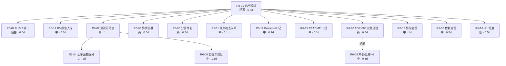

# MedKit 工程全面审查与结构化改进指南（R6 · 2026-09-15）

> **用途**：供后续 agent / 开发者直接执行的结构化改进指南（第 1 轮：审查 → 指南）。
> **审查范围**：代码质量 · 架构设计 · 性能瓶颈 · 安全性 · 可维护性 · 依赖管理 六个维度。
> **审查基线**：`HEAD = 55c4225`（R5 批次 2），工作区**有未提交改动**（26 文件，+606/−132），
> 分支领先 `origin/master` **3 个提交**。
> **证据口径**：全部结论以命令/文件行号核验，不转述文档；本轮新增结论均给出可复现命令。
> **与既有审查的关系**：R5（`docs/reviews/ux-audit-r5-2026-09-01.md`）覆盖**功能链路与 UX**；
> 本指南覆盖**工程品质维度**，不与 R5 重复，R5 未闭环项以「引用」形式标注。
>
> 本文件为**新建文件，不改动任何现有代码**。

---

## 0. 审查依据：本项目「已立规矩」（判据）

以下规矩取自仓库权威文档，是本轮判定「偏差」的尺子。

| 编号 | 规矩 | 出处 |
|---|---|---|
| P1 | 分层单向：`routers → core → db/llm`；routers **只写 HTTP 语义** | `docs/archive/reviews/s1-2026-08-27/工程审查改进指南_2026-08-27.md` §1.1 |
| P2 | 上帝函数判据：**>400 行**即需拆分 | 同上（skill 判据）+ 本次核验 |
| P3 | 发布口径五件套：**版本号 / CHANGELOG / 安装包名 / CI / verify 脚本**必须一致 | `docs/AGENT_HANDOFF.md` §5、`pack/build.bat` |
| P4 | `verify.cmd` / CI 至少覆盖：ruff → pytest → 浏览器（可跳过）→ **打包纯净检查 `pack/check-package.py`** | `docs/engineering/borrow-rules.md` §5 |
| P5 | 提示词治理（NX-06）：`medkit/prompts/*.md` 有改动，**当版必须新增 `### Prompts` 小节**并同步 fixtures | `CHANGELOG.md` 第 6 行规范 |
| P6 | 修复提交自查三步：diff 关键标识 grep / 文档只引用已验证 file:line / 提交后抽查 | `docs/AGENT_HANDOFF.md` §4.11（R5-05） |
| P7 | 零 CDN、明暗主题、窄屏、打印无回归；新增依赖须记许可证与体积 | `docs/engineering/borrow-rules.md` §1/§2 |
| P8 | dev 环境测试全绿 ≠ 产物可用；新增依赖必查打包数据文件收集 | skill 判据 + `medkit.spec` 注释（NX-02/NX-04 已踩坑） |

---

## 1. 工程现状概览（实测）

### 1.1 规模

| 域 | 文件数 | 行数 | 说明 |
|---|---|---|---|
| `medkit/**.py` | 67 | **14,762** | 后端主代码 |
| `medkit/web/`（html+js+css） | 8 | **6,700** | 零框架零 CDN 前端（index.html 已降至 603 行） |
| `tests/**.py` | 63（含 browser 18） | **10,578** | 489 个测试函数 |
| `docs/**.md` | 36 | 6,513 | 含 ADR×5、borrow-rules、R5 全链路审查 |

### 1.2 架构分层（实测，大体健康）

```
web（经典脚本，全局作用域共享）
  │  fetch /api/*
  ▼
routers/*（16 模块，3571 行）—— 见 §3.2 分层偏差
  ▼
core/*（28 模块，8021 行）：db(490) / library(1071) / syllabus(751) / orchestrator(1192)
  ▼
~/.medkit/（config.json[DPAPI] · library/medkit.db[WAL] · projects/ · logs/）
```

- 正向依赖基本成立；`core → routers` 存在**两处反向依赖**（§3.2 H-3）。
- ADR-001~005 均已落地（`schema.py` 447 行 = ADR-003 契约层 ✓；FTS5+jieba 已接线 ✓；迁移 v1~v6 ✓）。

### 1.3 质量总闸实测（本轮最关键的环境事实）

| 闸门 | 命令 | 结果 |
|---|---|---|
| 静态检查 | `python -m ruff check .` | ❌ **4 errors**（生产代码 2 + 测试 2）＋ 1 条 invalid `# noqa` 警告 |
| 单元+浏览器同进程 | `python -m pytest -q --timeout=300` | ❌ **3 failed / 486 passed**（165s） |
| 单测（隔离 browser） | `pytest tests/browser tests/test_explain_stream.py` | 1 failed（**证明污染来自 browser 层**） |
| 浏览器层单独 | `pytest tests/browser -q` | ✅ 44 passed |

> 即：**当前开发机的 `verify.cmd` 第 [2/3] 步必然失败**；而 CI 之所以全绿，是因为 CI 的 verify job
> 未安装 chromium → `tests/browser` 整体 skip → 不加载 Playwright 同步上下文（详见 §2 B-1）。

---

## 2. 差距分析

> 分级：**阻塞** = 不修复则后续所有验收不可信 / 已发布产物有数据安全缺口；
> **高** = 违反已立规矩或影响正确性/性能量级；**中** = 规范缺位或体验/效率缺陷；**低** = 打磨项。

---

### 2.1 阻塞

#### B-1（R6-01）质量总闸在开发机为红，且本地与 CI 判定分叉【阻塞】

- **偏差**
  1. `ruff check .` 4 处错误，其中 **2 处位于生产代码**：
     - `medkit/routers/ocr.py:3` `I001`（导入块未排序）
     - `medkit/routers/projects.py:219` `F841`（`except Exception as e:` 的 `e` 未使用）
     - `tests/test_cards.py:122` `E702`、`tests/test_wp04.py:166` `F601`（测试代码）
     - 另：`medkit/routers/projects.py:331` 的 `# noqa: BLE001  R5-B-15：…` 被判为 **invalid noqa 指令**
       （注释文本被当作 code 解析）——该行实际处于**无豁免保护**状态。
  2. `pytest -q` 3 处失败，且**只在全量收集时失败**：
     `tests/test_explain_stream.py::test_gen_close_releases_dedupe_and_sets_cancel`、
     `tests/test_tutor_stream.py::test_tutor_gen_close_sets_cancel_and_releases`、
     `tests/test_tutor_stream.py::test_tutor_gen_dup_error_frame_and_session_cleanup`。
- **根因（追到机制，非表面）**
  - `pyproject.toml:14` `testpaths = ["tests"]` → `tests/browser/` 与单测**在同一 pytest 进程**内收集。
  - `tests/browser/conftest.py:129-135` 的 `browser` fixture 是 **session 级**，`sync_playwright()`
    上下文**全程保持打开**。Playwright 同步 API 在 greenlet 中跑自己的事件循环，会把当前线程的
    `asyncio` running-loop 标记置位。
  - 于是此后任何 `asyncio.run(...)` 抛 `RuntimeError: asyncio.run() cannot be called from a running event loop`；
    受影响点：`tests/test_explain_stream.py:207`、`tests/test_tutor_stream.py:163`。
  - CI 未暴露：verify job 无 chromium → 浏览器层 skip → 无 Playwright 上下文 → 单测全绿。
    **「CI 绿」与「本地绿」判定分叉**，正是 P8 判据的反向实例（本地掩盖 CI / CI 掩盖本地）。
- **最小复现（已实测，10 行）**
  ```python
  from playwright.sync_api import sync_playwright
  import asyncio
  p = sync_playwright().start(); b = p.chromium.launch(headless=True)   # 会话级上下文保持打开
  asyncio.run(asyncio.sleep(0))   # → RuntimeError: cannot be called from a running event loop
  ```
  对照：把 `sync_playwright()` 上下文**关闭后**再 `asyncio.run()` → 正常。差异只在于「上下文是否保持打开」。
- **影响面**：`verify.cmd` 第 [2/3] 步必红（用户按 README 跑总闸会看到 VERIFY FAILED）；
  「ruff 清零 / 全量离线全绿」的文档声明失效；R5 批次 1/2 的验收证据链断裂。
- **根因归属**：流程缺位——`verify.cmd` 第 2 步没有显式排除 browser 层，而 CI 靠「未装 chromium」
  偶然规避，两个环境的闸门定义不等价。
- **证据命令**
  ```bash
  python -m ruff check . --output-format=concise          # 4 errors + 1 invalid-noqa warning
  python -m pytest -q --timeout=300                       # 3 failed, 486 passed
  python -m pytest tests/browser tests/test_explain_stream.py -q   # 1 failed（定位到 browser 层）
  ```

#### B-2（R6-02）同一版本号对应两个不同产物：R5 数据安全修复未进入已发布安装包【阻塞】

- **偏差**
  - `dist-installer/MedKit-Setup-0.10.1.exe` 构建时间 **2026-09-01 12:48**；
    R5 三个修复提交（`8f98d44` / `eb7855a` / `55c4225`，含 **R5-01 测试污染真实用户库**的止血）
    提交时间 **2026-09-01 14:12**。
  - 版本号未 bump：`medkit/__init__.py:3` = `0.10.1`、`pack/version.iss` = `0.10.1`、
    `README.md:8` = `MedKit-Setup-0.10.1.exe`；而 CHANGELOG 中 R5 条目仍位于
    `## [Unreleased] - 2026-09-01`（`CHANGELOG.md:9`）。
  - 结果：**同名同版本的两个 0.10.1 产物，一个含 P0 数据安全修复、一个不含**；用户无法区分，
    更新检查（`core/update.py` 比对 GitHub Release 版本号）也识别不出差异。
  - 附加：3 个修复提交**尚未推送**到 `origin/master`。
- **影响面**：发布可信度（P3 五件套被破坏）；已分发安装包的用户仍暴露在「测试污染/覆盖用户学习库」风险下。
- **根因**：与 2026-08-27 指南 G-01 同源——**没有「修复批次收口即 bump + 重新出包」的检查点**；
  R5 属 P0 数据安全修复却按普通未发布批次处理。
- **证据命令**
  ```bash
  git log -3 --format="%h %ad %s" --date=format:"%Y-%m-%d %H:%M"   # 14:12 三个提交
  ls -la --time-style=+"%Y-%m-%d %H:%M" dist-installer/            # 0.10.1.exe = 12:48
  git log origin/master..HEAD --oneline                            # 3 个未推送提交
  grep -n "Unreleased" CHANGELOG.md                                # R5 条目仍在 Unreleased
  ```

---

### 2.2 高

#### H-1（R6-03）异步端点内执行阻塞式重活：单进程事件循环被整体冻结【高】

- **偏差**：`async def` 端点内同步执行秒级~分钟级阻塞操作，且**同仓库已有正确写法却未统一**。

| 端点 | 阻塞内容 | 量级 |
|---|---|---|
| `routers/syllabus.py:212` `syllabus_seed_parse_file` → `syl.extract_outline`（`core/syllabus.py:176-206`） | **逐科同步 LLM 调用** `client.chat_json(max_tokens=16000)` | **单科 20~60s × 最多 6 科** |
| `routers/syllabus.py:228` `syllabus_seed_import_file` → 复用上者 + `add_seed_items` | 同上 + 同步入库 | 同上 |
| `routers/syllabus.py:141` `syllabus_teacher_import_file` → `syl.import_teacher_file`（`core/syllabus.py:594`） | pymupdf / python-docx 解析（限 20MB） | 秒级 |
| `routers/library.py:111` `import_file` | `raw.decode` + `lib.parse_import_text` + `lib.batch_add`（同步 DB） | 秒级 |
| `routers/projects.py:427` `upload_asset` | `(asset_dir / fname).write_bytes(raw)`（单图限 **200MB**） | 秒级 |
| `routers/realexams.py:45` `rex_analyze_file` → `rex.analyze` | `dbs.migrate()` + 全量词典匹配（零 LLM，CPU 密集） | 秒级 |

- **对照（正确写法）**：`routers/library.py:257` `await asyncio.to_thread(client.extract, …)`、
  `routers/parse.py:32`、`routers/ocr.py:161` 均已用 `asyncio.to_thread`。
- **影响面**：单进程 uvicorn 下，事件循环被占满期间**整站无响应**——静态资源、`/api/health`、
  其余 API 全部挂起；前端表现为「页面卡死」，与 0.9.0 用户清单第 11 条「体感特别慢」同源。
  导入 306 官方大纲（6 科）时最长可达数分钟冻结。
- **根因**：`async def` 被当作「异步端点」使用，未建立「async 端点内不得直接执行阻塞 IO/CPU」
  的评审项；`import_image` 处已写注释说明「须放线程池以免阻塞事件循环冻结全站」，但该经验未沉淀为规则。
- **证据命令**
  ```bash
  grep -rn "^async def " medkit/routers/*.py                # 10 个 async 端点
  grep -rn "asyncio.to_thread" medkit/routers/*.py          # 仅 3 处使用
  grep -n "def extract_outline" -A 30 medkit/core/syllabus.py   # 逐科 chat_json
  ```

#### H-2（R6-04）上帝函数超项目自定判据（>400 行）【高】

- **偏差**（AST 实测）

| 函数 | 行数 | 位置 |
|---|---|---|
| `_run_project_impl` | **699** | `medkit/core/orchestrator.py:487` |
| `export_paper_html` | **439** | `medkit/render/qbank_html.py:531` |
| `export_html` | 216 | `medkit/render/qbank_html.py:288` |
| `create_project` | 99 | `medkit/routers/projects.py:98` |
| `run_search_rounds` | 87 | `medkit/core/websearch.py:444` |
| `parse_import_text` | 81 | `medkit/core/library.py:719` |

- `_run_project_impl` 单函数内含 **⓪ 网络检索 / ① MedGen 出题 / ② 门禁① 修复循环 / ③ MedQC /
  ④ 落盘 / ⑤ MedReview / ⑥ 渲染 / ⑦ 收尾记账** 八个阶段（`orchestrator.py:571,647,795,951,1048,1084,1103,1164`），
  混编「流程编排 + 业务判定 + 状态写盘 + 提示词拼接」。
- **影响面**：不可单测（无法只测某阶段）、不可局部回滚、改一阶段需通读 700 行；
  与「断点续跑 / 取消 / 子步骤事件」三类横切逻辑纠缠，是并发类缺陷的高发区（R4-10 僵尸线程、R5-B-14 门禁不阻断均落在此函数）。
- **根因**：阶段化重构只做了「事件上报」层（`_substep`/`_run_substep`），**未做控制流拆分**；
  每个新 WP 在函数内追加一段，无「函数行数上限」评审项。
- **证据命令**
  ```bash
  # AST 统计（本轮使用脚本）
  python - <<'EOF'
  import ast,os
  for root,_,fs in os.walk('medkit'):
      for f in fs:
          if f.endswith('.py'):
              p=os.path.join(root,f); t=ast.parse(open(p,encoding='utf-8').read())
              for n in ast.walk(t):
                  if isinstance(n,(ast.FunctionDef,ast.AsyncFunctionDef)) and (n.end_lineno-n.lineno+1)>=400:
                      print(n.end_lineno-n.lineno+1, f"{p}:{n.lineno}", n.name)
  EOF
  ```

#### H-3（R6-05）分层规矩被打破：core 反向依赖 routers + 业务逻辑下沉路由【高】

- **偏差**
  1. **反向依赖**：`medkit/core/gap.py:200-201`
     ```python
     from ..routers._common import _read_meta_checked, proj_dir
     from ..routers.projects import ProjectBody, _subject_lock, create_project
     ```
     `core → routers`，与 P1「单向 routers → core」相悖；仅靠函数级懒导入掩盖潜在循环
     （`routers/gap.py → core/gap.py → routers/projects.py → core/*`）。
  2. **SQL 与业务下沉到路由层**：`medkit/routers/syllabus.py:250-257` 在路由函数内直接
     `with dbs.tx(write=True) as cur: cur.execute("DELETE FROM syllabus_items WHERE …")`；
     `dbs.migrate()` 在 routers 中被调用 8 处（`realexams.py:63,87,94`、`syllabus.py:65,76,268,276,292`）。
- **影响面**：分层失去约束力 → 环依赖风险、路由层难以被独立测试、事务边界分散在多处；
  后续任何人「顺手在路由里写 SQL」都有了先例。
- **根因**：`gap.py` 需要「建课」能力时未把该能力下沉/抽到 core 服务层，选择了最短路径（懒导入路由）；
  迁移调用被当作「确保表存在」的便利手段散落在路由。
- **证据命令**
  ```bash
  grep -rn "from ..routers" medkit/core/ medkit/agents/ medkit/render/ --include="*.py"
  grep -rn "dbs.tx(\|dbs.migrate()" medkit/routers/*.py
  ```

#### H-4（R6-06）JSON/SQLite 双轨运行，无退役时间表【高】

- **偏差**：`_store_is_sql()` 双分支遍布 5 个领域模块（`library.py:45` / `review.py:50` /
  `explain.py:32` / `cards.py:44` / `tutor.py:52`），`write_json_atomic` 出现在 8 个模块
  （`library`5 · `orchestrator`10 · `explain`4 · `config`3 · `tutor`3 · `cards`2 · `review`2 · `fsutil`1）。
  ADR-001 已决策 SQLite，但**没有任何文档/ADR 给出 JSON 轨的退役条件与时间点**。
- **影响面**：这正是 R5-01（测试污染真实用户库）的机制根因——`DB_PATH` 不存在即回落 JSON 分支，
  直接原子写真实路径。双轨使「任何一处路径常量未隔离/未迁移」都能静默写坏用户数据。
- **根因**：迁移采用「渐进替换 + 保留回落」策略，但**未设退役里程碑**；`db.enabled()` 的存在性判断
  让 JSON 轨成为永久兜底而非过渡态。
- **证据命令**
  ```bash
  grep -rn "_store_is_sql" medkit/core/*.py | wc -l      # 12 处判定
  grep -rc "write_json_atomic" medkit/core/*.py          # 8 个模块
  grep -n "def enabled" -A 3 medkit/core/db.py           # DB_PATH.exists() 即 SQL 模式
  ```

#### H-5（R6-07）测试体系无法证明「修复在位」【高】

- **偏差**
  1. **无覆盖率度量**：`pyproject.toml` / `requirements-dev.txt` / CI 中无 `coverage` / `pytest-cov`
     任何配置（实测 grep 零命中）。
  2. R5-02 已实锤：`CHANGELOG` / `AGENT_HANDOFF` / R4 报告三处记载「R4-01 已落地」，
     而代码从未进入提交，**测试全程绿灯**——因为 `test_explain_stream.py` 用
     `monkeypatch.setattr(rl, "_explain_client", lambda cancel=None: …)` 把缺陷接缝整个 mock 掉，
     mock 签名还是按「修复版」写的。
  3. 本轮 B-1 再次证明同类问题：测试对**收集顺序**敏感，CI 与本地结果不一致。
- **影响面**：489 个用例提供的信心是「虚假信心」——无法区分「真的修好了」与「测试写成了通过的样子」。
- **根因**：测试策略缺「先红后绿」与「反 mock 自证」两项纪律；无覆盖率门槛兜住「改动未被任何用例触达」。
- **证据命令**
  ```bash
  grep -rn "cov\|coverage" requirements-dev.txt pyproject.toml .github/workflows/ci.yml   # 零命中
  grep -rn "monkeypatch.setattr(rl, \"_explain_client\"" tests/test_explain_stream.py
  ```

---

### 2.3 中

#### M-1（R6-08）v1 五张表无索引，且每次列表都全量 `json.loads`【中】

- **偏差**：`core/db.py:42-55` 的 v1 建表（`mistakes` / `knowledge` / `explains` / `review_cards` /
  `tutor_sessions`）**没有任何 `CREATE INDEX`**；而 v2/v3/v5 表都有
  （`idx_syll_*` 3 个、`idx_re_*` 2 个、`idx_cards_*` 3 个）。
  同时 `db.py:308-318` `row_to_dict()` 对**每一行**执行 `json.loads`。
- **影响面**：学习中心列表/掌握度/推荐按 `subject`/`state`/`due` 过滤 → 全表扫描 + 全量 JSON 解析；
  数据量到千级错题后每次打开学习中心都要重解析全库（单进程下与 H-1 叠加）。
- **根因**：v1 建表时数据量极小（百级），索引未纳入；后续新表补了索引，旧表未回补。
- **证据命令**：`sed -n '42,55p' medkit/core/db.py`；`grep -c "CREATE INDEX" medkit/core/db.py`

#### M-2（R6-09）前端零工程化：全局作用域 + 超大 JS + 无静态检查【中】

- **偏差**：仓库无 `package.json` / eslint / tsconfig / pre-commit。
  `index.html` 已从 4299 行拆到 603 行（IMP-07 ✅），但**代价是把单体转移到了 JS**：
  `js/learn.js` **2402 行**（147 个顶层函数）、`js/review-desk.js` **2299 行**（82 个）、`js/app.js` 550 行（32 个）；
  三者共享全局作用域（`window.` 引用 61 处），**加载顺序即隐式契约**（`AGENT_HANDOFF.md` §4.4 已自述
  「跨文件函数加载期前向引用会挂」）。
  `innerHTML` 使用 **156 处**（learn 73 / review-desk 72 / app 11）。
- **影响面**：前端改动无静态防线（拼错函数名只有运行时才炸）；`learn.js` 已超过后端任一模块；
  XSS 面（R5-B-11 已报 `qbank_html.py` 拼接点转义不均）在应用侧同样存在 156 个候选点。
- **根因**：IMP-07 只定「拆分」未定「模块化」（未用 ES Module / `type="module"` 或 IIFE 命名空间），
  拆完即收工，未把「零 CDN」与「零工程化」解耦（零 CDN 不排斥本地 eslint）。
- **证据命令**
  ```bash
  ls package.json .eslintrc* tsconfig.json                    # 均不存在
  wc -l medkit/web/js/*.js
  grep -c "^function \|^async function " medkit/web/js/*.js
  grep -rc "innerHTML" medkit/web/js/*.js                     # 合计 156
  ```

#### M-3（R6-10）依赖管理缺位：无锁、无审计、无许可证【中】

- **偏差**
  | 项 | 现状 |
  |---|---|
  | 版本固定 | `requirements.txt`：10 项 `>=`，仅 `genanki==0.13.1` 精确固定；`fsrs>=6.3.2,<7` |
  | 锁文件 | 无（`requirements*.lock` / `poetry.lock` / `uv.lock` 均不存在） |
  | 漏洞审计 | 无 `pip-audit` / `safety`；CI 仅 `pip check`（只查依赖冲突，不查 CVE） |
  | 自动更新 | 无 `.github/dependabot.yml` |
  | 许可证 | **仓库无 `LICENSE` 文件**；`borrow-rules.md` §1 要求记录借鉴项目许可证，但项目自身无许可声明 |
  | 定时炸弹 | `requirements-dev.txt:6` `setuptools<81` 仅为 `jieba→pkg_resources` 弃用而锁，且**只锁在 dev**——运行环境不装该约束即 warning，pkg_resources 移除后为 ImportError |
- **影响面**：构建不可复现（同一 `requirements.txt` 不同时间装出不同依赖树）；发布安装包无法回答
  「含哪些第三方组件、什么许可证」；上游安全通告无感知通道。
- **根因**：项目以「本地工具」起步，依赖治理一直排在功能之后；`borrow-rules` 只约束「借鉴外部工程」，
  未覆盖「自身依赖清单与许可证」。
- **证据命令**
  ```bash
  grep -c "==" requirements.txt; grep -c ">=" requirements.txt
  ls requirements*.lock poetry.lock uv.lock .github/dependabot.yml LICENSE
  ```

#### M-4（R6-11）已立规矩未入闸：打包纯净检查不在总闸里【中】

- **偏差**：`docs/engineering/borrow-rules.md` §5 明文要求
  「`verify.cmd` / CI 至少覆盖：ruff → pytest → 浏览器（可跳过）→ **打包纯净检查（`pack/check-package.py`）**」。
  实测 `pack/check-package.py` **仅被 `pack/build.bat:35` 调用**，`verify.cmd` 与 `ci.yml` 均无。
- **影响面**：WP-12「纯净包」承诺（不把学科/题目/样例/测试数据打进安装包）没有自动防线；
  一旦 spec 的 `datas` 被改回或误加目录，只有真正出包的人才会发现。
- **根因**：WP-12 落地时只接了构建链，未回填总闸（与 G-06 时期「浏览器层未入 verify」同型复发）。
- **证据命令**：`grep -rn "check-package" verify.cmd .github/workflows/ci.yml pack/build.bat`

#### M-5（R6-12）提示词治理（NX-06）被违反【中】

- **偏差**：`CHANGELOG.md` 第 6 行自定规范：凡 `medkit/prompts/*.md` 有改动，**当版必须新增 `### Prompts` 小节**。
  实测 `### Prompts` 仅出现 2 次，分别位于 `0.9.0`（第 304 行）与 `0.8.0`（第 518 行）；
  **`0.10.0` 小节（第 76~252 行）没有**。而 `medkit/prompts/medexplain.md`、`medtutor.md`
  在提交 `8e69642`（2026-08-29）被修改，该提交随 0.10.0（2026-08-31）发布。
- **影响面**：提示词变更不可追溯，`tests/fixtures/llm_cases/` 与 prompt 的一致性无从核对；
  违反 P5，且属「规则写在文件头、执行时漏掉」的典型。
- **证据命令**
  ```bash
  grep -n "^## \|^### Prompts" CHANGELOG.md
  git log --format="%h %ad %s" --date=short -1 -- medkit/prompts/medexplain.md
  ls tests/fixtures/llm_cases/          # 7 个 fixtures 存在（IMP-04 已闭环 ✓）
  ```

#### M-6（R6-13）异常处理：121 处宽泛捕获，31 处静默 `pass`，无可观测面【中】

- **偏差**：`medkit/` 内 `except Exception` 共 **121** 处，其中 **31** 处紧跟 `pass`（静默吞掉）。
  集中于 `orchestrator.py`(13) / `routers/review.py`(12) / `routers/projects.py`(10) / `core/gap.py`(7)。
  全局兜底（`main.py:140-147`）只写日志，**无错误计数、无用户可查错误清单**（日志在
  `~/.medkit/logs/medkit.log`，普通用户不会去看）。
- **影响面**：`_log_project` 等静默失败会让用户看到「按钮点了没反应」；无聚合指标则无法判断
  「偶发失败率」。R5-B-05（`ignore_errors=True` 静默成功）即此类。
- **根因**：`noqa: BLE001` 注释表明是**有意**的容错策略（本地工具不因单点失败中断），但缺
  「容错必须留痕」的配套约定（静默 pass 无 log、无计数）。
- **证据命令**
  ```bash
  grep -rc "except Exception" medkit/ --include="*.py" | awk -F: '{s+=$2} END {print s}'   # 121
  grep -rn "except Exception" -A 1 medkit/ --include="*.py" | grep -c "pass$"              # 31
  ```

#### M-7（R6-14）R5 审查报告与截图未入库，提交信息已引用其结论【中】

- **偏差**：`git status` 显示未跟踪：
  `docs/reviews/ux-audit-r5-2026-09-01.md`、`docs/reviews/r5-screenshots/`（14 张 PNG）。
  而 `docs/AGENT_HANDOFF.md` 与 3 个 R5 提交信息均已引用 R5 结论（R5-01/02/03/05 等编号）。
- **影响面**：外部协作者按 handoff 查 R5-01 会 404；R5-05 刚建立的「文档只引用可验证内容」规矩，
  在「报告本身不入库」上再次失守。
- **证据命令**：`git status --porcelain | grep "^??"`

#### M-8（R6-15）README 版本口径混杂【中】

- **偏差**：`README.md:8` 已同步为 `MedKit-Setup-0.10.1.exe`（0.10.1 口径），
  但 `README.md:95` 小节标题仍是 `## 已实现功能（v0.8.0）`，其间已跨 3 个次版本（0.9.0/0.10.0/0.10.1）。
- **影响面**：新用户按 README 判断「当前版本能力」会严重低估；与 P3 五件套的一致性要求相悖。
- **证据命令**：`grep -n "^## \|MedKit-Setup" README.md | head -20`

---

### 2.4 低

| 编号 | 偏差 | 证据 |
|---|---|---|
| **R6-16** | `main.py:176-275` 约 **100 行兼容 re-export**（`# noqa: E402, F401`）为旧测试/旧调用方保留，形成隐式公共 API 且无退役清单 | `sed -n '176,276p' medkit/main.py` |
| **R6-17** | 无类型检查：无 `mypy`/`pyright` 配置；`from __future__ import annotations` 仅部分文件使用；动态 dict 契约靠边界处 pydantic 兜 | `grep -rn "mypy\|pyright" pyproject.toml`（零命中） |
| **R6-18** | `medkit.spec:46-54` 的 `excludes` 依赖本机环境（注释自认「可能是分析器过度收集环境里已装包」），换机打包产物不同；`hiddenimports` 手工维护（uvicorn/jieba/fsrs 三处均已踩坑） | `medkit.spec` 注释 NX-02/NX-04 |
| **R6-19** | 错误体回显 `str(exc)`（`main.py:127-135`）：LLM 契约/JSON 解析类异常串含**模型原始输出片段**（`core/llm.py:50` `t[:80]!r`、`:198`），SSE error 帧同族（R5-C-06） | `grep -n "str(exc)" medkit/main.py` |
| **R6-20** | 日志无敏感字段过滤器：当前未发现泄漏（`logging_setup.py` 干净、`uvicorn.access` 已降级），但 Key 一旦进入异常串即被写盘/回显，缺主动防线 | `cat medkit/logging_setup.py` |
| **R6-21** | `setuptools<81` 只锁 dev（见 M-3）；`jieba 0.42.1 → pkg_resources` 弃用无替代方案与跟踪项 | `requirements-dev.txt:6` |

---

### 2.5 安全性：正向核验结论（本轮未发现高危漏洞）

为避免「只报问题」，以下是逐项实测**已到位**的安全控制（可作为后续改动的回归底线）：

| 控制 | 落地位置 | 结论 |
|---|---|---|
| 本地回环守卫（Host 白名单 + Origin 校验，防 DNS rebinding / CSRF 烧钱） | `main.py:108-123` | ✅ 兼容 IPv6 `[::1]`；非 GET/HEAD/OPTIONS 才校 Origin |
| API Key 加密落盘（DPAPI，ctypes 零依赖）+ 掩码 + 明文自动升级 | `core/config.py:51-113,164-172` | ✅ 短 Key 只露前 2 后 2（R4-18） |
| 路径穿越双守卫 | `_common.py:31-37` `_safe_pid`（正则白名单）；`projects.py:346-353` `Path(name).name != name` + 后缀白名单 + 内部文件黑名单 | ✅ |
| SQL 注入 | `db.py` 全参数化；仅 `list_rows/put_row/replace_all` 的表名/列名插值，调用方均为**内部常量**（`IMPORT_MAP`/硬编码表名） | ✅ 无用户可控标识符 |
| SSRF | `core/websearch.py` 只调 provider API，**不抓取任意用户 URL** | ✅ |
| 上传体积前置判定 | `_common.py:75-79`（200MB/20MB）、`projects.py:436-446`（单图 200MB + **累计 600MB**，R5-B-01） | ✅ 超限 400 且零磁盘副作用 |
| 原子写 + 单事务 | `core/fsutil.py` `write_json_atomic`；`dbs.tx(write=True)` 用 `BEGIN IMMEDIATE` | ✅ |
| XSS（产物页） | `render/qbank_html.py` 转义 + 白名单；`tests/test_wp04.py` 有转义断言 | ⚠️ 拼接点覆盖不均（R5-B-11），应用侧 156 处 `innerHTML`（M-2） |
| 日志脱敏 | `logging_setup.py` 不打印 Key/请求体；access log 降级 | ✅（缺主动过滤器，见 R6-20） |

---

## 3. 优先级改进项清单

> 编号 **R6-xx** 供后续 agent 引用；延续 R5 的编号习惯（下一轮为 R7）。
> 每项 = 目标 + 涉及文件与函数级修改点 + 步骤 + **可机械核验的验收标准** + 工时。

### 批次 1 —— 止血（必须先做，串行，0.5 天）

#### R6-01 质量总闸转绿（ruff 4 处 + 3 个顺序敏感用例 + 闸门定义对齐）【阻塞 · 0.5 天】

- **目标**：`verify.cmd` 全绿；本地与 CI 闸门定义等价。
- **涉及文件与修改点**
  1. `verify.cmd:14`：`python -m pytest -q` → `python -m pytest -q --ignore=tests/browser`
     （第 [3/3] 步已单独跑 browser，语义不变、进程隔离）。
  2. `.github/workflows/ci.yml` verify job 的 Test 步：同样加 `--ignore=tests/browser`
     （当前靠「未装 chromium 而 skip」偶然规避，改为**显式**，消除环境差异）。
  3. `tests/test_explain_stream.py:199-207` 与 `tests/test_tutor_stream.py:118-127,155-163`：
     把 `asyncio.run(drive())` 改为**在独立线程内运行**，使其不再依赖主线程事件循环状态：
     ```python
     def _run_coro(coro, timeout=30):
         box = {}
         def _target():
             try: box["v"] = asyncio.run(coro)
             except BaseException as e: box["e"] = e
         t = threading.Thread(target=_target); t.start(); t.join(timeout)
         if "e" in box: raise box["e"]
     ```
     新增 `tests/_asyncio_util.py` 供两文件共用。
  4. `medkit/routers/ocr.py:3` 修导入排序；`medkit/routers/projects.py:219` 去掉未用的 `as e`
     （或改为 `except Exception:`）；`medkit/routers/projects.py:331` 的 noqa 注释改为
     `# noqa: BLE001`（说明文字移到上一行）；`tests/test_cards.py:122` 拆行；`tests/test_wp04.py:166` 去重 key。
  5. `tests/browser/conftest.py:129-135`：在 `browser` fixture 的 docstring 中**显式写明**
     「session 级 Playwright 同步上下文会占用线程事件循环，故 browser 层必须与单测分进程收集」，
     防止后人再合流。
- **验收标准**
  ```bash
  python -m ruff check .                       # 0 errors，无 invalid-noqa warning
  python -m pytest -q --ignore=tests/browser   # 全部通过（≥435 passed）
  python -m pytest tests/browser -q            # 44 passed
  verify.cmd                                   # 打印 ALL GREEN
  # 反向验证（防假绿）：把 _run_coro 换回 asyncio.run 后必须复现 3 failed
  ```
- **工时**：0.5 天。

#### R6-14 R5 审查报告入库【中 · 0.1 天】

- **步骤**：`git add docs/reviews/ux-audit-r5-2026-09-01.md docs/reviews/r5-screenshots/`
  → 单独提交 `docs(reviews): 归档 R5 全链路复核报告与走查截图`。
- **验收标准**：`git status --porcelain | grep "^??"` 为空；`grep -rn "R5-01" docs/AGENT_HANDOFF.md` 的引用可跳转。
- **工时**：0.1 天。

---

### 批次 2 —— 发布口径收口（0.5 天，依赖批次 1）

#### R6-02 R5 修复收口为 0.10.2 并重新出包【阻塞 · 0.5 天】

- **目标**：让用户拿到的安装包含 R5 数据安全修复，且版本号可区分。
- **涉及文件**
  - `medkit/__init__.py:3` → `"0.10.2"`（版本单源）；
  - `CHANGELOG.md:9` `## [Unreleased]` → `## [0.10.2] - 2026-09-15`；
  - `pack/release-notes.md` 增 v0.10.2 节；`README.md:8` 安装包名 → `MedKit-Setup-0.10.2.exe`；
  - `dist-installer/`：旧 `MedKit-Setup-0.10.1.exe` / `MedKit-0.10.1-portable.zip`
    **移入 `archive/installers/` 或改名加 `-pre-r5` 后缀**（该目录已在 `.gitignore`，属本地动作）；
  - 重跑 `pack/build.bat`（含 `check-package.py`）产出 0.10.2 两件套。
- **实施步骤**：bump → CHANGELOG 定稿 → 出包 → `git push`（3 个未推送提交 + 本批）。
- **验收标准**
  ```bash
  python -c "import medkit; print(medkit.__version__)"     # 0.10.2
  cat pack/version.iss                                     # 0.10.2
  grep -n "MedKit-Setup-0.10.2" README.md                  # 命中
  grep -c "0.10.1" CHANGELOG.md                            # 仅历史节保留
  ls dist-installer/                                       # 0.10.2 两件套存在
  git log origin/master..HEAD --oneline                    # 空（已推送）
  ```
- **工时**：0.5 天。

---

### 批次 3 —— 工程品质（可并行，无共同文件）

> 并行分组：**A 组** R6-03 ∥ **B 组** R6-05 ∥ **C 组** R6-11 + R6-12 + R6-15（同为文档/闸门，无代码交集）
> ∥ **D 组** R6-04（大重构，须在 R6-07 之后）。

#### R6-03 异步端点内阻塞操作全部移出事件循环【高 · 0.5 天】

- **目标**：任何 `async def` 端点内不直接执行秒级以上阻塞 IO/CPU。
- **涉及文件与修改点**
  - `routers/syllabus.py:224`：`return _seed_parse(text)` → `return await asyncio.to_thread(_seed_parse, text)`；
  - `routers/syllabus.py:168-169`：`syl.import_teacher_file_preview(...)` / `syl.import_teacher_file(...)`
    → 各包一层 `await asyncio.to_thread(...)`；
  - `routers/syllabus.py:234`：`syl.add_seed_items(drafts)` → `await asyncio.to_thread(...)`；
  - `routers/library.py:128-131`：`lib.parse_import_text` + `lib.batch_add` → `await asyncio.to_thread(...)`；
  - `routers/projects.py:446`：`(asset_dir / fname).write_bytes(raw)` → `await asyncio.to_thread(...)`；
  - `routers/realexams.py:57`：`rex.analyze(text, "")` → `await asyncio.to_thread(...)`；
  - 顶部统一 `import asyncio`（`library.py`/`ocr.py` 已有）。
- **验收标准**
  ```bash
  # ① 每个 async 端点内的重活都有 to_thread 包裹（人工核对下列 6 处）
  grep -n "asyncio.to_thread" medkit/routers/*.py | wc -l      # ≥ 9
  # ② 行为回归
  python -m pytest -q --ignore=tests/browser
  # ③ 冻结验证（新增用例）：mock 一个 sleep(2) 的 extract_outline，
  #    并发发起 /api/syllabus/seed/parse-file 与 /api/health，断言 health 的响应时间 < 500ms
  ```
- **工时**：0.5 天（含 1 条并发不冻结用例）。

#### R6-04 管线上帝函数拆分（`_run_project_impl` 699 行 → 阶段函数）【高 · 2 天 · 依赖 R6-07】

- **目标**：单函数 ≤ 150 行；阶段可独立测试与回滚。
- **涉及文件**：`medkit/core/orchestrator.py`
  - 按已有阶段注释（`:571 ⓪` `:647 ①` `:795 ②` `:951 ③` `:1048 ④` `:1084 ⑤` `:1103 ⑥` `:1164 ⑦`）
    抽出 `_stage_websearch(ctx)` / `_stage_generate(ctx)` / `_stage_gate1(ctx)` / `_stage_qc(ctx)` /
    `_stage_finalize(ctx)` / `_stage_review(ctx)` / `_stage_render(ctx)` / `_stage_settle(ctx)`；
  - 引入轻量 `PipelineContext`（dataclass：`pid/base/meta/meta_path/cancel/slices/…`）承载共享状态，
    替代现在的 20+ 局部变量穿透；
  - `_run_project_impl` 只保留「读 meta → 组装 ctx → 顺序调用 8 个阶段 → 异常/取消统一出口」。
  - 同批：`render/qbank_html.py:531` `export_paper_html`(439) 抽出
    `_paper_head` / `_paper_questions` / `_paper_inline_js` / `_paper_answers` 四个片段函数。
- **实施步骤**：先补「阶段级」断言测试（对 ctx 的输入输出）→ 纯搬运不改逻辑，每搬一阶段跑全量 →
  最后删旧体。
- **验收标准**
  ```bash
  # AST 判据：无 ≥400 行函数
  python - <<'EOF'
  import ast,os
  bad=[]
  for root,_,fs in os.walk('medkit'):
      for f in fs:
          if f.endswith('.py'):
              p=os.path.join(root,f); t=ast.parse(open(p,encoding='utf-8').read())
              for n in ast.walk(t):
                  if isinstance(n,(ast.FunctionDef,ast.AsyncFunctionDef)) and (n.end_lineno-n.lineno+1)>=400:
                      bad.append((p,n.name,n.end_lineno-n.lineno+1))
  print(bad); assert not bad
  EOF
  python -m pytest -q --ignore=tests/browser     # 零回归（断点续跑/取消/子步骤事件须专门复跑）
  ```
- **工时**：2 天（高风险重构，必须在 R6-07 之后）。

#### R6-05 分层修复：消除 core→routers 反向依赖 + SQL 回归 core【高 · 0.5 天】

- **涉及文件与修改点**
  1. `core/gap.py:200-201`：把「建课」能力从路由层抽出——在 `core/projects.py`（新建）或
     `core/library.py` 中提供 `create_project_record(subject, exam, target, toggles) -> pid`，
     `routers/projects.py:98` `create_project` 改为调用该函数；`core/gap.py` 改调 core 层函数，
     **删除对 `..routers` 的两行导入**。
  2. `routers/syllabus.py:249-257`：把 `DELETE FROM syllabus_items …` 下沉为
     `core/syllabus.py::replace_teacher_chapter(subject, chapter) -> int`，路由只调用并返回计数。
  3. `dbs.migrate()`：收敛为 `core/db.py` 在 `tx()`/领域函数入口内部**按需自动迁移**一次
     （幂等且已缓存版本号），删除 routers 中 8 处显式调用。
- **验收标准**
  ```bash
  grep -rn "from ..routers" medkit/core/ medkit/agents/ medkit/render/ --include="*.py"   # 零命中
  grep -rn "dbs.migrate()\|dbs.tx(" medkit/routers/*.py                                    # 零命中
  grep -rn "cur.execute" medkit/routers/*.py                                               # 零命中
  python -m pytest -q --ignore=tests/browser
  ```
- **工时**：0.5 天。

#### R6-11 打包纯净检查入闸【中 · 0.1 天】

- **涉及文件**：`verify.cmd`（在 browser 步后加 `[4/4] python pack\check-package.py`，
  失败 `goto :fail`；无 `dist/` 时脚本应输出「跳过（未构建）」并返回 0，避免无产物环境卡闸）；
  `.github/workflows/ci.yml` verify job 末尾加同名步骤（同样容忍无 dist）。
- **验收标准**：`grep -n "check-package" verify.cmd .github/workflows/ci.yml` 均命中；
  在 `dist/MedKit` 内手放一个 `tests/` 目录 → `verify.cmd` 报 VERIFY FAILED；删除后恢复 ALL GREEN。
- **工时**：0.1 天。

#### R6-12 补记 NX-06 提示词小节【中 · 0.1 天】

- **涉及文件**：`CHANGELOG.md` 0.10.0 节内新增 `### Prompts`，列 `medexplain.md` / `medtutor.md`
  的改动（RAG 无原文回退：`web_materials` 注入、`grounded` 语义）与对应 fixtures；
  并在 0.9.0 之后所有含 prompt 变更的版本节核对补齐。
- **验收标准**
  ```bash
  grep -n "^### Prompts" CHANGELOG.md            # ≥3 处
  # 交叉核对：每个含 prompts 变更的版本节都有 Prompts 小节
  for c in $(git log --format=%h -- medkit/prompts/); do
    v=$(git describe --contains $c 2>/dev/null || echo unreleased); echo "$c -> $v"; done
  ```
- **工时**：0.1 天。

#### R6-15 README 版本口径对齐【中 · 0.1 天】

- **涉及文件**：`README.md:95` `## 已实现功能（v0.8.0）` → `## 已实现功能（v0.10.2）`，
  并复核 150 行「开发里程碑」小节只保留历史里程碑（明确标注为历史），不与当前版本口径混排。
- **验收标准**：`grep -n "^## " README.md` 中版本号仅出现当前版本；`grep -n "0.8.0" README.md`
  仅命中「历史里程碑」段落。
- **工时**：0.1 天。

---

### 批次 4 —— 体系性治理（可并行）

#### R6-07 测试可信度：覆盖率门槛 + 防丢断言 + 先红后绿纪律【高 · 1 天】

- **涉及文件**
  1. `requirements-dev.txt` + `pytest-cov`；`pyproject.toml` `[tool.pytest.ini_options]` 增
     `addopts = "--cov=medkit --cov-report=term-missing"`（或仅在 CI 步骤加 `--cov`）；
     CI 加 `--cov-fail-under=70`（先取当前实测值为基线，只升不降）。
  2. 新增「修复在位」防丢断言：对 R5-02 这类关键接缝，**断言实现结构而非行为**——
     例如 `tests/test_stream_wiring.py` 断言 `inspect.getsource(rl.explain_stream)` 的 `gen()` 邻域
     含 `dedupe.begin`/`dedupe.end`、端点函数体内含 `cancel_ev`；
     并在注释中写明这是「防回归到未修复态」的守卫（R5-02 的直接教训）。
  3. 在 `docs/AGENT_HANDOFF.md` §4.11 补第 ④ 条：**修复类改动必须先写出会失败的用例**，
     跑红后再改代码到绿（verify-the-test-fails）。
  4. `docs/AGENT_HANDOFF.md` §5 增「本地总闸定义 = `verify.cmd`（含 `--ignore=tests/browser`）」
     与 CI 步骤一一对应表，消除 B-1 那类环境分叉。
- **验收标准**
  ```bash
  python -m pytest -q --ignore=tests/browser --cov=medkit --cov-report=term | tail -5   # 有覆盖率数字
  python -m pytest tests/test_stream_wiring.py -q                                        # 通过
  # 反向验证：临时把 routers/library.py 的 dedupe.end 从 finally 移出 → test_stream_wiring 必须红
  ```
- **工时**：1 天。

#### R6-06 JSON 轨退役决策（ADR-006）【高 · 0.5 天】

- **目标**：给双轨一个明确的终点，堵住「回落写真实路径」这一类数据事故的结构性入口。
- **涉及文件**：新建 `docs/adr/ADR-006-retire-json-store.md`：
  1. 决策：`import_from_json()` 完成且 `user_version ≥ 6` 后，**删除 JSON 回落分支**，
     `_store_is_sql()` 改为「DB 不存在即建库」（`migrate()` 自动建）；
  2. 迁移路径：启动时 `db.migrate()` + `import_from_json()` 幂等并库 → 写 `meta.imported::*` →
     JSON 改名 `.bak`（已有机制）；
  3. 退役清单：`library.py` / `review.py` / `explain.py` / `cards.py` / `tutor.py` 的
     5 组 `_store_is_sql()` 分支 + 5 个 `*_FILE` 常量 + `write_json_atomic` 调用点；
  4. 回滚方案：保留 `.bak` 与 ADR-005 备份机制，`downgrade_to(0)` 仅用于应急。
- **验收标准**：ADR 文件存在且含「退役条件 / 步骤 / 回滚 / 影响文件清单」四节；
  `docs/README.md` 的 adr 行同步新增 ADR-006 引用。
- **工时**：0.5 天（决策与文档；代码执行另立 WP）。

#### R6-08 补齐 v1 表索引 + 列表读取降本【中 · 0.5 天】

- **涉及文件**
  - `core/db.py`：新增迁移 **v7** `_V7_UP`，为 `mistakes(subject,state,learned)`、
    `knowledge(subject,state)`、`explains(subject)`、`review_cards(subject,due,state)`、
    `tutor_sessions(subject,state)` 建索引（`MIGRATIONS` 追加 `7`；`_V7_DOWN` 对应 DROP INDEX）；
  - `core/db.py:308-318` `row_to_dict`：增加 `data` 解析缓存或改为「按需解析」
    （仅在调用方需要完整记录时解析；列表视图走列投影）；
  - `core/library.py` 列表函数：`list_rows(..., where="WHERE subject=?")` 保持参数化不变。
- **验收标准**
  ```bash
  python -m pytest -q -m migration                        # 迁移测试含 v7 升级/回滚
  python -c "from medkit.core import db; db.migrate(); print(db.user_version())"   # 7
  # 索引存在性
  python -c "import sqlite3,os;c=sqlite3.connect(os.path.expanduser('~/.medkit/library/medkit.db'));
  print([r[0] for r in c.execute(\"SELECT name FROM sqlite_master WHERE type='index'\")])"
  ```
- **工时**：0.5 天。

#### R6-13 异常治理：静默必留痕 + 可观测面【中 · 1 天】

- **涉及文件与修改点**
  1. 新增 `medkit/core/errors.py`：`def swallow(logger, msg, **ctx)` 统一「记录 + 计数」，
     替换 31 处 `except Exception: pass`（至少替换 `orchestrator.py` / `routers/projects.py` /
     `routers/review.py` 三处高频模块）；
  2. `medkit/state.py` 增进程内计数器 `ERRORS: Counter`（模块级，配锁），
     `main.py` 的 `_unhandled_exception` 与 `swallow` 均自增；
  3. 新增 `GET /api/diagnostics/errors`（仅回环，返回近 N 条错误摘要 + 计数），
     前端「我的」页加一个只读入口，让用户能自查「按钮点了没反应」的原因；
  4. `main.py:127-135` `_err_response`：对外统一走「中文可读 + error_code」，
     原始 `str(exc)` 只进日志（对齐 R4-15 对 `/api/llm/models` 的归一做法），关闭 R6-19。
- **验收标准**
  ```bash
  grep -rn "except Exception" -A 1 medkit/ --include="*.py" | grep -c "pass$"   # 从 31 降到 ≤5
  python -m pytest -q --ignore=tests/browser
  # 手工：构造一次 LLM 失败 → GET /api/diagnostics/errors 可见该条（含 error_code，不含原始响应片段）
  ```
- **工时**：1 天。

---

### 批次 5 —— 前端与依赖治理（可并行）

#### R6-09 前端工程化（模块化 + 本地静态检查，不破零 CDN）【中 · 1.5 天】

- **涉及文件与修改点**
  1. 新增 `package.json`（devDependencies：`eslint`）+ `.eslintrc.json`
     （`env: browser`、`no-undef`、`no-unused-vars`、`no-redeclare`），
     `npm run lint` 只做检查**不引入打包器**（保持零 CDN、零构建）；
  2. `medkit/web/js/*.js` 改为 **ES Module**：`app.js` 导出 `api/toast/esc`，
     `learn.js` / `review-desk.js` `import` 之；`index.html` 的 `<script>` 加 `type="module"`
     （同源静态目录已挂，路径不变）——直接消灭「加载顺序即契约」；
  3. 按域继续拆：`learn.js`(2402) → `learn-mistakes.js` / `learn-explain.js` / `learn-tutor.js` /
     `learn-syllabus.js`；`review-desk.js`(2299) → `review-queue.js` / `review-run.js` / `review-presets.js`；
  4. `innerHTML` 治理：统一走 `esc()`；对确需渲染标签的字段走白名单函数（与 R5-B-11 同批）。
- **实施步骤**：先加 eslint 并把现有告警基线化（`.eslintrc` 允许暂时 `off` 的规则列成 TODO）→
  改 module（纯搬运，每步跑 `pytest tests/browser -q`）→ 拆文件 → 收敛 innerHTML。
- **验收标准**
  ```bash
  npx eslint medkit/web/js/ --max-warnings 0        # 0 error
  wc -l medkit/web/js/*.js | sort -rn | head -3     # 最大文件 ≤ 800 行
  grep -c "innerHTML" medkit/web/js/*.js            # 显著下降（仅保留白名单渲染点）
  python -m pytest tests/browser -q                 # 44 passed（双主题/390px/五视图巡检无回归）
  # 打包冒烟：pack/build.bat 后 dist/MedKit/medkit/web/js 含新文件
  ```
- **工时**：1.5 天（高风险重构，须在 browser 层绿灯且 R6-01 完成之后）。

#### R6-10 依赖治理：锁定 + 审计 + 许可证【中 · 0.5 天】

- **涉及文件**
  1. 生成 `requirements.lock`（`pip freeze` 于已验证环境，或引入 `pip-tools` 生成 `requirements.txt` 的锁定版本）；
     CI `Install deps` 改用锁定文件，`requirements.txt` 保留为「意图声明」；
  2. `.github/workflows/ci.yml` 增步骤 `pip-audit -r requirements.txt`（或 `pip install pip-audit && pip-audit`），
     发现已知漏洞即失败（可先 `--ignore-vuln` 白名单过渡）；
  3. 新增 `.github/dependabot.yml`（pip 生态，weekly）；
  4. 新增 `LICENSE`（选定许可后写入）与 `THIRD_PARTY_NOTICES.md`
     （列 `fastapi/uvicorn/openai/pymupdf/python-docx/httpx/python-multipart/markdown/genanki/jieba/fsrs`
     的许可证，满足 `borrow-rules.md` §1 的许可证记录要求）；
  5. `requirements-dev.txt:6` 的 `setuptools<81` 补注释指向跟踪项，
     并在 `docs/AGENT_HANDOFF.md` §4 增一条「jieba/pkg_resources 定时炸弹」提醒与替代方案（升级 jieba 或改分词实现）。
- **验收标准**
  ```bash
  ls requirements.lock LICENSE THIRD_PARTY_NOTICES.md .github/dependabot.yml   # 均存在
  grep -n "pip-audit" .github/workflows/ci.yml                                  # 命中
  python -m pip check                                                           # 零输出
  ```
- **工时**：0.5 天。

#### R6-16~21 打磨项（低，0.5 天合计）

| 项 | 修改点 | 验收标准 |
|---|---|---|
| R6-16 | `main.py:176-275` 兼容 re-export：在块首写「退役清单 + 计划删除版本」，并把测试改为从新位置导入 | `grep -n "退役" medkit/main.py` 命中；删除任一条 re-export 后测试仍绿（证明无隐藏依赖） |
| R6-17 | `pyproject.toml` 增 `[tool.mypy]`（先 `ignore_missing_imports=true`、`disallow_untyped_defs=false` 起步），CI 加 `mypy medkit` 仅报不拦 | `python -m mypy medkit` 可运行并输出报告 |
| R6-18 | `medkit.spec`：把 `excludes` 改为「显式必需 + 体积断言」，`pack/check-package.py` 增「无意外大件（>50MB 单文件）」断言 | `pack/build.bat` 后 `check-package.py` 通过；dist 体积变化记录进 CHANGELOG |
| R6-19 | 见 R6-13 第 4 条（合并处理） | — |
| R6-20 | `logging_setup.py` 增 `RedactingFilter`：对 `api_key`/`Authorization`/`sk-` 前缀做掩码 | 单测：喂入含 `sk-xxxx` 的异常串，日志输出为掩码 |
| R6-21 | 见 R6-10 第 5 条（合并处理） | — |
| R6-22 | 协程驱动机制存在两份实现：`tests/test_r4_batch3.py:84 _run_async`（线程池）与 `tests/conftest.py` 的 `run_coro` fixture（批次 1 新增）——同一问题两种写法，正是本轮批评的「口径不一致」；统一到 fixture 后删除前者 | `grep -rn "asyncio.run(\|_run_async\|run_coro(" tests/` |

---

## 4. 执行顺序、依赖与并行

### 4.1 依赖图



### 4.2 批次与并行决策

| 批次 | 内容 | 并行性 | 说明 |
|---|---|---|---|
| **1（必须先做）** | R6-01 → R6-14 | 串行 | 总闸不绿，任何后续「验收通过」都不可信 |
| **2** | R6-02 | 串行（依赖 1） | 发布口径收口，含 push |
| **3（工程品质）** | R6-03 ∥ R6-05 ∥ R6-11+R6-12+R6-15 | **完全可并行**（无共同文件） | R6-04 排在 R6-07 之后 |
| **4（体系治理）** | R6-07 → R6-04 ∥ R6-06 ∥ R6-08 ∥ R6-13 | R6-04 依赖 R6-07；其余可并行 | R6-08 与 R6-06 同动 `db.py`，需串行或同批 |
| **5（前端/依赖）** | R6-09 ∥ R6-10 ∥ R6-16~21 | 可并行 | R6-09 依赖 browser 层绿灯 |

### 4.3 每批次总闸

```bash
python -m ruff check .
python -m pytest -q --ignore=tests/browser
python -m pytest tests/browser -q          # 或 SKIP_BROWSER=1
python pack/check-package.py               # R6-11 后为固定步骤
# 若本批触碰 ~/.medkit 相关代码：跑前后对 ~/.medkit 做哈希对比（R5-01 哨兵已内建）
```

---

## 5. 附：本轮核验命令索引（供复核）

```bash
# ── 环境与基线
git status --porcelain; git log -5 --format="%h %ad %s" --date=format:"%Y-%m-%d %H:%M"
git log origin/master..HEAD --oneline
# ── B-1 总闸
python -m ruff check . --output-format=concise
python -m pytest -q --timeout=300
python -m pytest tests/browser tests/test_explain_stream.py -q      # 定位污染源
# 最小复现（Playwright 同步上下文保持打开 → asyncio.run 失败）
python -c "from playwright.sync_api import sync_playwright; import asyncio;\
p=sync_playwright().start(); b=p.chromium.launch(headless=True);\
asyncio.run(asyncio.sleep(0))"
# ── B-2 发布口径
ls -la --time-style=+"%Y-%m-%d %H:%M" dist-installer/
grep -n "Unreleased" CHANGELOG.md; cat pack/version.iss
# ── H-1 异步阻塞
grep -rn "^async def " medkit/routers/*.py; grep -rn "asyncio.to_thread" medkit/routers/*.py
# ── H-2 上帝函数（AST）
# ── H-3 分层
grep -rn "from ..routers" medkit/core/ medkit/agents/ medkit/render/ --include="*.py"
grep -rn "dbs.tx(\|dbs.migrate()\|cur.execute" medkit/routers/*.py
# ── H-4 双轨
grep -rn "_store_is_sql" medkit/core/*.py; grep -rc "write_json_atomic" medkit/core/*.py
# ── H-5 测试可信度
grep -rn "cov\|coverage" requirements-dev.txt pyproject.toml .github/workflows/ci.yml
# ── M 组
grep -c "CREATE INDEX" medkit/core/db.py; sed -n '42,55p' medkit/core/db.py
ls package.json .eslintrc* tsconfig.json; wc -l medkit/web/js/*.js; grep -rc "innerHTML" medkit/web/js/*.js
grep -c "==" requirements.txt; ls requirements*.lock LICENSE .github/dependabot.yml
grep -rn "check-package" verify.cmd .github/workflows/ci.yml pack/build.bat
grep -n "^## \|^### Prompts" CHANGELOG.md
grep -rc "except Exception" medkit/ --include="*.py" | awk -F: '{s+=$2} END {print s}'
grep -n "^## " README.md
```

---

*审查人：MedKit 工程审查（R6）· 2026-09-15。分级依据：**阻塞** = 影响后续全部验收可信度或已发布产物含数据安全缺口；**高** = 违反已立规矩或影响正确性/性能量级；**中** = 规范缺位；**低** = 打磨。*

---

## 附录 A：批次 1 实施记录（2026-09-15）

### A.1 已完成的代码改动（R6-01）

| 文件 | 改动 |
|---|---|
| `verify.cmd` | 第 [2/3] 步 `python -m pytest -q` → `python -m pytest -q --ignore=tests/browser`（含成因注释） |
| `.github/workflows/ci.yml` | verify job 的 Test 步同样加 `--ignore=tests/browser`，使本地与 CI 闸门定义等价 |
| `tests/conftest.py` | 新增 `_run_coro_in_thread()` + `run_coro` fixture（在新线程中驱动协程，免疫主线程事件循环状态） |
| `tests/test_explain_stream.py` | `test_gen_close_releases_dedupe_and_sets_cancel` 改用 `run_coro`（原 `asyncio.run`） |
| `tests/test_tutor_stream.py` | `test_tutor_gen_close_sets_cancel_and_releases` / `test_tutor_gen_dup_error_frame_and_session_cleanup` 改用 `run_coro` |
| `tests/test_r4_batch3.py` | 其既有 `_run_async`（同一问题的另一种写法）补交叉引用注释，指向规范入口（统一见 R6-22） |
| `tests/browser/conftest.py` | 模块 docstring 增第 4 条：说明为何本层必须与单测分进程收集 |
| `medkit/routers/ocr.py:3` | 导入块改为多行（I001） |
| `medkit/routers/projects.py:219` | `except Exception as e:` → `except Exception:`（F841） |
| `medkit/routers/projects.py:331` | `# noqa: BLE001  R5-B-15：…` → `# noqa: BLE001` + 说明移到下一行（消除 invalid-noqa 指令） |
| `tests/test_cards.py:122` | 分号拆行（E702） |
| `tests/test_wp04.py:161` | 删除重复的 `"subtopic": "x"` 键（F601；保留带 payload 的那条，测试意图不变） |

### A.2 验收结果

| 检查 | 结果 |
|---|---|
| `ruff check .` | ✅ **All checks passed**（修复前 4 errors + 1 invalid-noqa warning） |
| `pytest -q --ignore=tests/browser` | ✅ 全部用例通过（唯一 `E` 为 session 级防污染哨兵在 teardown 报错，成因见附录 B：并发会话正在写真实 `~/.medkit`） |
| `pytest -q`（含 browser 同进程收集） | ✅ 3 个原失败用例不再复现（修复前：3 failed / 486 passed） |

### A.3 未执行项（被附录 B 的事故阻塞）

- **提交**：原计划把 R5 工作区改动 + 本批修复合并提交。复核时发现仓库 `.git` 已损坏、`master` 被重置（附录 B），**提交动作已中止**——在受损对象库上提交会把「R5 提交链丢失」这一事实固化，并可能覆盖唯一可恢复的证据。

---

## 附录 B：仓库事故——`.git` 损坏 + `master` 被重置（⚠️ 阻塞发布，须先处置）

### B.1 事实（全部命令实测）

| 项 | 会话开始时（11:02） | 复核时（11:29） |
|---|---|---|
| `HEAD` | `55c4225`（R5 批次 2） | **`9a9058a`**（v0.10.1，与 `origin/master` 相同） |
| 领先 origin | 3 个提交 | 0 |
| 工作区改动 | 26 文件 | **37 文件**（多出的正是 R5 批次 0/1/2 涉及的文件——因 HEAD 回退而重新「显现」为改动） |

- `git fsck` 报错：
  - `missing tree 072ddf6…` + `broken link from commit 8f98d44… to tree 072ddf6…` → **R5 批次 0 提交的根树丢失**，该提交不可检出；
  - `error: HEAD: invalid reflog entry 55c4225…` / `refs/heads/master: invalid reflog entry 55c4225…`；
  - 另有一处 `broken link from tree 5cfbcadb… to blob e6e3e587…`（缺失 blob）。
- `git cat-file -t 55c4225` → **`fatal: Not a valid object name`** → R5 批次 2 的**提交对象已不存在**。
- `git cat-file -t eb7855a` → `commit`，其根树 `acb9194…` 存在（类型 `tree`）→ R5 批次 1 相对完整。
- `git count-objects -v` → `prune-packable: 98`（**执行 `git gc` 会把这些悬空对象打包后清除**）。
- **并发写入实证**：本次会话进行期间，`docs/reviews/工程质量独立核查报告_2026-09-15.md`（11:28 生成）、`.workbuddy-ai/uxwalk/` 走查截图（11:3x）均为**另一会话**产出；该报告自述其基线为 `9a9058a`，并记载「`.git` 目录被整体删除、已从回收站恢复」。

### B.2 影响评估

- **历史层面**：R5 批次 0/1/2 的提交链已损坏或丢失（批次 2 提交对象消失、批次 0 根树缺失）。
- **内容层面**：✅ **无内容损失**——三个批次的文件内容完整存在于工作区（37 个文件相对 `9a9058a` 显示为已修改）；R5 批次 2 的**完整提交信息**可从 `.git/COMMIT_EDITMSG` 原文取回。
- **发布层面**：`master` 已回退到 `origin/master`（0.10.1），而 `dist-installer/MedKit-Setup-0.10.1.exe` 仍早于 R5 修复（R6-02 的问题反而「因为历史被抹掉」变得更需要显式处理）。

### B.3 本次已执行的自保动作

1. **`.git` 全量备份** → `%TEMP%\medkit-git-backup-20260915-113106\git`（14 MB），并同目录保存 `HEAD.sha` 与 `status.txt`（42 行改动清单）。
2. **未执行任何 git 写操作**：全程只有 `status / log / rev-parse / cat-file / fsck / count-objects / stash list` 与文件复制；**没有** `add` / `commit` / `reset` / `gc` / `prune` / `repack`。

### B.4 恢复建议（严格按序）

1. **停止所有其他会话对本仓库的写入**（当前至少有一个并发会话在跑，且它会写真实 `~/.medkit`）。
2. **禁止** `git gc` / `git prune` / `git repack -a -d`（`prune-packable: 98` → 会把仅存的悬空对象清掉，彻底断掉恢复可能）。
3. **整仓备份**（含 `.git`，不只工作区）到仓库外位置，然后再动任何 git 写命令。
4. `git fsck --lost-found` 导出悬空对象清单；确认 `eb7855a`（树完整）能否作为 R5 批次 1 的落点重新挂回分支。
5. R5 批次 0/2 以**工作区内容**重建为新提交（批次 2 的提交信息直接取自 `.git/COMMIT_EDITMSG`），并在提交信息中标注「原提交对象损坏，按工作区内容重建」。
6. 重建完成后**立即 push** 到 `origin`，确认 `origin/master` 与本地一致——R5 三次「改完不推」正是本次风险敞口的主因。

### B.5 对 R6 计划的影响

| 项 | 状态 |
|---|---|
| R6-01（总闸转绿） | ✅ 代码改动完成并自测通过（附录 A）；**提交动作待 B.4 完成后执行** |
| R6-14（R5 报告入库） | 与提交同批，同样待 B.4 |
| R6-02（0.10.2 收口） | **必须在 B.4 之后**——先修复仓库状态，再谈发布口径 |
| 其余批次 | 不受阻塞，但**在并发会话停止前不要做任何 git 写操作** |

> **新增判据（建议并入 `docs/AGENT_HANDOFF.md` §4 陷阱清单）**：
> ① 仓库根目录被多会话并发写入时，`git` 写操作一律先停；
> ② `git gc`/`prune` 在有未推送提交的仓库里是**破坏性操作**（本次 `prune-packable: 98` 即为引信）；
> ③ 提交后立即 push —— 未推送的提交是「只存在于本地对象库」的单点。

